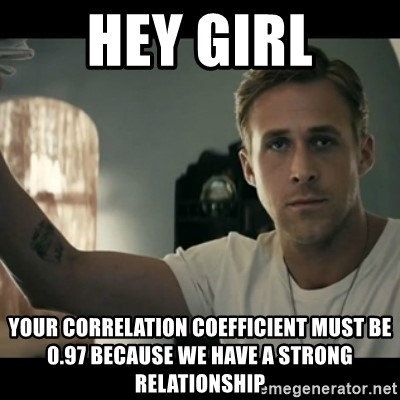

class: inverse, middle, title-slide, spaced

```{r setup, include=FALSE}
library(fontawesome)
library(tidyverse)
library(emo)
options(htmltools.dir.version = FALSE, width=120)
```

class: title-slide, spaced

   

# Multigroup Structural Equation Modeling (SEM)
## Menggunakan `JASP`: Bagian 2 - Korelasi
<br>
### <b>Rizqy Amelia Zein</b>
* Dosen, [Fakultas Psikologi, Universitas Airlangga](https://psikologi.unair.ac.id)
* Anggota, [#SainsTerbuka Airlangga](https://sainsterbukaua.github.io/) `r fa("universal-access")`
* Relawan, [INA-Rxiv](https://inarxiv.id) 
* Researcher-in-training, [Institute for Globally Distributed Open Research and Education (IGDORE)](https://igdore.org/)

---

class: inverse

# Mengapa memulai dari korelasi?

--

#### SEM merupakan teknik yang digunakan untuk **mengestimasi korelasi** antar-variabel

--

#### Untuk melakukan SEM, peneliti tidak harus meng*input* data kasar (*raw data*), tetapi ada pilihan untuk meng*input* *correlation* atau *variance-covariance matrix*.


---

# Jenis-jenis korelasi

| Koefisien Korelasi | Level Pengukuran |
| ------------------ | ---------------- |
| *Pearson's product moment* | Kedua variabel setidaknya interval |
| *Spearman's rank* dan *Kendall's tau* | Kedua variabel ordinal |
| *Phi*, *contingency table* | Kedua variabel nominal |
| *Point biserial* | Variabel interval dengan nominal |
| *Gamma*, *rank biserial* | Variabel ordinal dengan nominal |
| *Biserial* | Variabel interval dengan *dummy* |
| [*Polyserial*](https://link.springer.com/article/10.1007/BF02294164) | Variabel interval dengan variabel *underlying continuity* |
| *Tetrachoric* | Kedua variabel *dummy* (dikotomis) |
| *Polychoric* | Kedua variabel ordinal (dengan kontinuitas implisit) |

---

# Faktor-faktor yang mempengaruhi korelasi

* **Level pengukuran** (apakah variabel tersebut nominal, ordinal, interval, atau rasio)
  - Sehingga berdampak pada **variabilitas** (*restriction range*) dan **normalitas data**
* **Linearitas**
  - Semua teknik korelasi mengasumsikan korelasi antar-variabel linear, sehingga korelasi yang tidak linear akan memberikan informasi **tidak adanya korelasi** (padahal tidak selalu).
* **Adanya data *outlier* **
* **Koreksi atenuasi**
* **Jumlah sampel**
  - Jumlah sampel yang terlalu sedikit akan memberikan estimasi yang kurang akurat (karena *standard error*nya besar)
* ***Sampling variance***
  - Yang kemudian berfek pada *confidence interval*, *effect size* (koefisien korelasi itu sendiri), dan *statistical power*
* ***Missing data***
  - Kalau data tidak lengkap, estimasi koefisien korelasi akan langsung terdampak.
  - Ada beberapa pilihan yang bisa dilakukan, yaitu `r fa("arrow-circle-right")` *listwise deletion*, *pairwise deletion*, dan melakukan *data imputation*.
  - *Listwise deletion* tidak disarankan karena membuat jumlah sampel turun drastis `r fa("arrow-circle-right")` mengurangi *statistical power*.
  
#### Silahkan unduh dan buka [**Dataset Korelasi**](https://rameliaz.github.io/mg-sem-workshop/corr.jasp), untuk melihat contoh.

---

# Koreksi Atenuasi

* Asumsi dasar dalam Psikometri adalah skor kasar (*observed score*) mengandung skor murni (*true score*) dan *measurement error*, sehingga dalam mengestimasi korelasi, *measurement error* perlu dibuang agar estimasi lebih akurat.

* Dengan teknik *koreksi atenuasi*, kita dapat 'membuang' *measurement error*, sehingga kita dapat mengestimasi korelasi antar-variabel menggunakan *true score*-nya.

* Tetapi apabila reliabilitas skala kita kurang baik, maka setelah dikoreksi **koefisien korelasi bisa lebih dari 1** `r emo::ji("exclamation")`

* Misalnya diketahui bahwa korelasi *observed scores* antar dua variabel (*r*<sub>ab</sub>) adalah 0.9 dan reliabilitas skala *a* (Cronbach's α) adalah 0.6 dan skala *b* adalah 0.7, maka:

<center></center><br>

---

class: inverse, middle, center

# Apa yang terjadi?

#### Perangkat lunak akan menghentikan proses estimasi

#### ...dan memberikan pesan *non-positive definite*


---

class: inverse, middle, center

# *WARNING! Covariance/correlation matrix is not positive definite*

<center></center><br>

---

# Matrik korelasi dengan *non-positive definite*

* Koefisien korelasi yang nilainya >=1 menyebabkan matriks korelasi menjadi *non-positive definite*
  - Artinya, parameter model tidak mungkin diestimasi

* Mengapa terjadi?
  - Data didapatkan dari observasi yang **tidak independen** (*linear dependency*)
  - Terjadi **multikolinearitas**
  - **Jumlah sampel** lebih **sedikit** dari jumlah variabel yang diuji dalam model
  - Sepasang variabel berbagi **varians negatif** atau **tidak sama sekali** (0) `r fa("arrow-circle-right")` *Heywood case*
  - Varians, kovarians, dan korelasi nilainya diluar batas kewajaran
  - Kesalahan mengatur pembatasan (*constraint*) pada parameter tertentu yang dilakukan oleh peneliti (*user-specified model*)
  
---

# *Heywood* dan *ultra-Heywood case*

* Terjadi ketika *communalities* = 1 (*Heywood*) atau >=1 (*ultra-Heywood*), atau terjadi ketika varians *measurement error* bernilai negatif
  - *Communalities* adalah kuadrat dari koefisien korelasi (*R*<sup>2</sup>)
  - Apabila terjadi, maka ada yang salah dengan spesifikasi model (hipotesis)

* Terjadi karena
  - *Common factor* terlalu banyak/terlalu sedikit
  - Ukuran sampel tidak memadai
  - Model SEM bukan model yang cocok untuk menguji hipotesis hubungan antar-variabel (alternatifnya [*Principal Component Analysis* - PCA](https://medium.com/@aptrishu/understanding-principle-component-analysis-e32be0253ef0))
  
* Yang bisa dilakukan
  - Tinjau kembali hipotesis modelnya
  - Kurangi jumlah faktor laten dengan 'membuang' jalur/korelasi yang bermasalah
  - Identifikasi variabel yang terlibat multikolinearitas. Masukkan salah satu saja dalam model, sisanya jangan.

---

# Korelasi Bivariat: *Part* dan *partial correlation*

<center></center><br>

---


---

class: center, middle

# Terima kasih banyak! `r emo::ji("wink")`


Paparan disusun dengan menggunakan `r fa("r-project")` *package* [**xaringan**](https://github.com/yihui/xaringan) dengan *template* dan *fonts* dari `R-Ladies`.

*Chakra* dibuat dengan [remark.js](https://remarkjs.com), [**knitr**](http://yihui.name/knitr), dan [R Markdown](https://rmarkdown.rstudio.com).