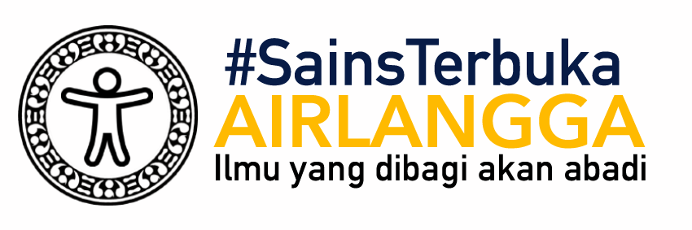
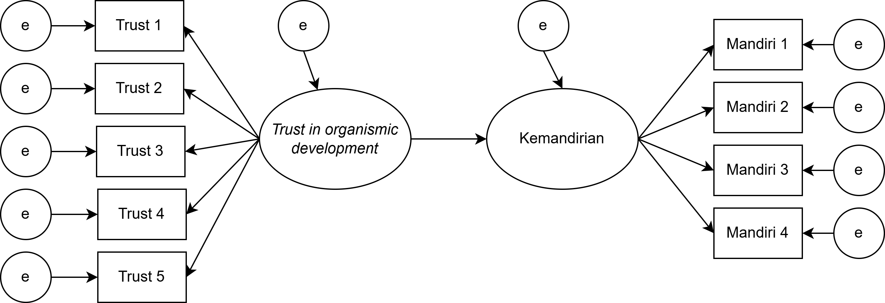

class: inverse, middle, title-slide, spaced

```{r setup, include=FALSE}
library(fontawesome)
library(tidyverse)
library(emo)
options(htmltools.dir.version = FALSE, width=120)
```

class: title-slide, spaced

   

# Multigroup Structural Equation Modeling (SEM)
## Menggunakan `JASP`: Bagian 3 - Model Jalur (*Path Model*) dan Model Regresi
<br>
### <b>Rizqy Amelia Zein</b>
* Dosen, [Fakultas Psikologi, Universitas Airlangga](https://psikologi.unair.ac.id)
* Anggota, [#SainsTerbuka Airlangga](https://sainsterbukaua.github.io/) `r fa("universal-access")`
* Relawan, [INA-Rxiv](https://inarxiv.id) 
* Researcher-in-training, [Institute for Globally Distributed Open Research and Education (IGDORE)](https://igdore.org/)

---

class: center, middle, inverse


### [Klik disini dan cari tahu apa yang terjadi..](https://kahoot.it/) `r emo::ji("love")`

---

class: inverse

# Analisis jalur

* *Path model* merupakan kelanjutan dari model regresi karena terdiri dari **beberapa model regresi** sekaligus dapat digunakan untuk menguji *direct*, *indirect*, dan *correlated effects*.

* *Path model* disusun secara visual dengan aturan tertentu (konsensus)
  - Garis satu arah menggambarkan *direct effects*, yang merefleksikan *keterkaitan langsung* antara satu variabel dengan variabel lainnya. Asumsinya, **tidak ada variabel lain diluar model** yang berkorelasi dengan variabel tersebut.
  - Garis dua arah menggambarkan *covariance*/korelasi, yang mengimplikasikan bahwa keterkaitan antar-variabel masih mungkin ditentukan oleh **variabel lain yang tidak ada di dalam model**.
  - Garis *error terms* yang menunjukkan varians *observed variable* yang menjelaskan **variabel lain yang tidak dapat dijelaskan/di luar model**, yang juga mewakili **measurement error**.

---

# Diagram jalur 

<center></center><br>

---

class: inverse, middle

# Contoh

.pull-left[

Marimar adalah seorang wali murid di sebuah PAUD di Kota Surabaya. Pada suatu hari, ia mengamati seorang anak (dan orangtua) yang perilakunya menarik perhatiannya. 

Ibu anak tersebut *ngotot* untuk menunggui anaknya di sekolah, padahal guru kelas meminta agar Ibu pulang saja, mempercayakan anak pada guru, dengan tujuan melatih kemandirian anaknya. 

Melihat ibunya yang menggerutu karena diminta bu Guru pulang, si anak menangis meraung-raung tidak mau ditinggalkan. Akhirnya, terpaksa bu Guru membiarkan si Ibu menunggu di sekolah. 

Marimar heran sekaligus penasaran, mengapa tiap anak **memberikan respon yang berbeda** ketika ditinggal orangtuanya di sekolah. Ada yang menangis meraung-raung, ada yang lebih santai dengan langsung bermain. Apakah ada kaitan antara kemandirian anak dengan karakteristik orangtuanya?

]

.pull-right[


]

---

# Variabel yang diukur Marimar

* **trust** (variabel independen) = Kepercayaan ibu bahwa perkembangan anak dapat berlangsung secara natural ([**trust in organismic development**](https://link.springer.com/article/10.1007/s11031-008-9092-2)). Diukur dengan skala *likert* yang terdiri dari 5 aitem dengan 7 pilihan respon `r fa("arrow-circle-right")` dari **sangat tidak setuju** sampai **sangat setuju**.

* **mandiri** (variabel dependen) = Tingkat kemandirian anak. Anak dengan skor yang tinggi semakin menunjukkan independensi dan lebih santai ketika ditinggal orangtuanya di sekolah. Marimar mengukurnya dengan melakukan observasi berdasarkan ada/tidaknya berbagai perilaku yang menunjukkan kemandirian. Diantaranya adalah:
  - Menangis ketika ditinggal orangtuanya
  - Merengek atau merajuk ketika ditinggal
  - Masuk ke dalam kelas tanpa ditemani
  - Menaruh tas dalam loker yang disediakan tanpa bantuan pengantar

### Bagaimana bentuk diagram jalurnya?

---

class: center, middle

<center></center><br>

---

# Koefisien jalur

| Koefisien | Huruf Yunani | Huruf Latin|
| --------- | ------------ | ---------- |
| Varians *error* dari variabel X | 


---

# Korelasi = kausalitas?

.pull-left[

* Analisis jalur sebenarnya adalah **bentuk yang lebih *sophisticated*** dari korelasi, dan

### **Correlation does not imply causation**

Yang harus dipenuhi sebagai bukti kausalitas:
* Ada **urutan waktu** (*temporal order*) `r fa("arrow-circle-right")` maka desain penelitian *panel*/*longitudinal*/*time series* harus digunakan
* Adanya **korelasi** antara kedua variabel
* Peneliti harus melakukan **kontrol** atas variabel lain yang mungkin menjelaskan korelasi tsb (melakukan manipulasi, mengestimasi *part* atau *partial correlation*)
* Peneliti melakukan **manipulasi** pada variabel X, yang menyebabkan perubahan pada variabel Y

]

.pull-right[


]

---

class: center, middle

# Terima kasih banyak! `r emo::ji("wink")`


Paparan disusun dengan menggunakan `r fa("r-project")` *package* [**xaringan**](https://github.com/yihui/xaringan) dengan *template* dan *fonts* dari `R-Ladies`.

*Chakra* dibuat dengan [remark.js](https://remarkjs.com), [**knitr**](http://yihui.name/knitr), dan [R Markdown](https://rmarkdown.rstudio.com).