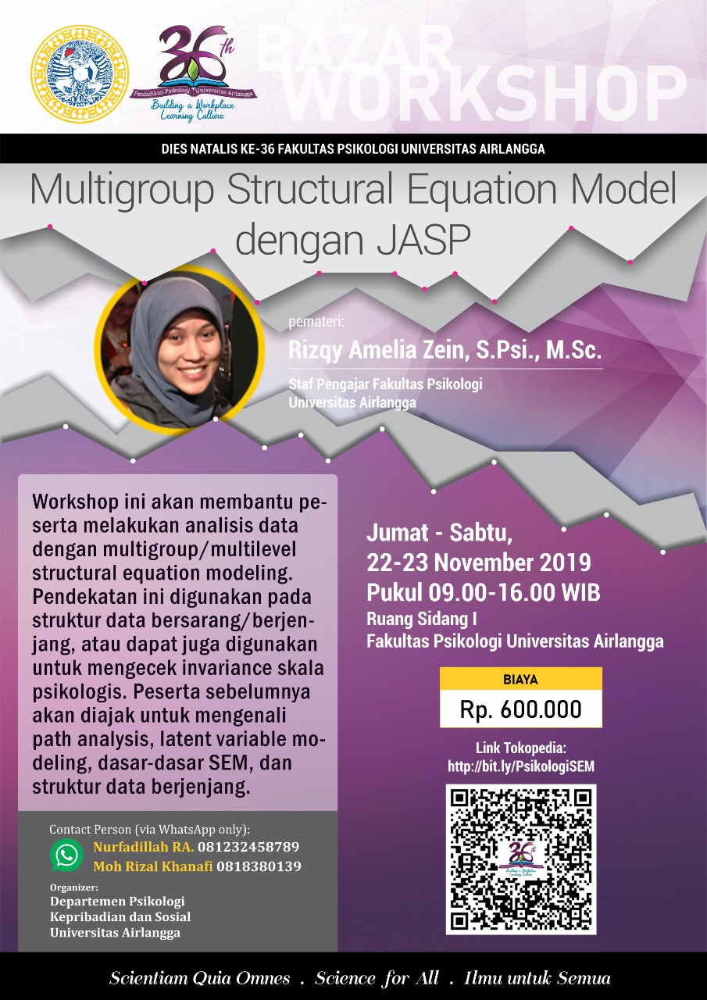

 
 

## Deskripsi
Berikut adalah repositori yang digunakan untuk menyimpan semua materi untuk **Workshop Multigroup Structural Equation Modeling (MG-SEM)** yang diselenggarakan oleh Departemen Psikologi Kepribadian dan Sosial, Fakultas Psikologi Universitas Airlangga dalam rangka memperingati Dies Natalis Pendidikan Psikologi Universitas Airlangga yang ke-36. 

Materi berlisensi [<i class="fab fa-creative-commons"></i> BY-SA 4.0](https://creativecommons.org/licenses/by/4.0/). **Materi bebas digunakan kembali namun wajib menyebutkan sumber aslinya**.

## Waktu dan tempat
*Workshop* diselenggarakan pada hari **Jumat-Sabtu, 22-23 November 2019**, pukul 09.00-16.00 WIB di Ruang Sidang I, Fakultas Psikologi Universitas Airlangga.

## *Outline* materi

Berikut adalah *outline* materi *workshop*: 

### **Hari 1**: Jumat, 22 November 2019

##### **Pengantar**
* Apa itu *structural equation modeling* (SEM)?
* Mengapa dan pada kondisi seperti apa SEM diperlukan?
* Beberapa pilihan perangkat lunak untuk mengeksekusi SEM
* Yang tidak dicakup dalam *workshop* serta keterbatasan JASP

##### **Korelasi**
* Jenis-jenis koefisien korelasi
* Faktor-faktor yang membuat koefisien korelasi bervariasiK
* [Koreksi atenuasi](https://methods.sagepub.com/reference/encyc-of-research-design/n81.xml) dan *measurement error*
* *Variance-covariance* dan *correlation matrix*
* *WARNING! Covariance/correlation matrix is not positive definite*
* [*Heywood* dan *ultra-Heywood case*](https://journals.sagepub.com/doi/10.1177/0049124112442138)
* Bivariat, *part*, dan *partial correlation*
* Metrik variabel (*standardised* vs *unstandardised*)

##### **Model Jalur** (*Path Model*) dan Model Regresi
* Definisi *path model*
* Nama variabel dan koefisien jalur (*path coefficients*)
  * δ (delta), ε (epsilon), ξ (ksi), η (eta), λ (lambda), γ (gamma), β (beta), φ (phi), ζ (zeta)
* Representasi visual model jalur menggunakan diagram jalur (*path diagram*)
* Menggambarkan hubungan antar-variabel dengan menggunakan diagram jalur
* *Syntax* `lavaan` untuk spesifikasi model jalur
* Asumsi kausalitas (?) dan limitasi

### **Hari 2**: Sabtu, 23 November 2019

##### **Confirmatory Factor Analysis (CFA)**
* Definisi *factor analysis*
* *Exploratory* vs *confirmatory factor analysis*
* Kapan menggunakan CFA?
* [*Constraining parameter* model](https://psycnet.apa.org/record/2008-06808-005)
* Model pengukuran (paralel, *tau equivalence*, dan *congeneric*)
* Variabel indikator (reflektif vs formatif)
* *Correlated error variances*
* Metode estimasi
* Menuliskan hasil analisis CFA dalam laporan penelitian

##### **Dasar-dasar Structural Equation Modeling (SEM)**
* Dasar-Dasar SEM: Model struktural & pengukuran
* Tahapan *modeling* dengan menggunakan SEM
  * Spesifikasi model
  * Identifikasi model
  * Estimasi model
  * Menguji model
  * Memodifikasi model
* *Degree of freedom*
* *Underidentified*, *just-identified*, dan *overidentified model*
* Jenis-jenis kriteria untuk menilai ketepatan model (*model fit*)
  * [*Model fit*](http://www.ejbrm.com/issue/download.html?idArticle=183)
  * *Model comparison*/*Incremental fit indices*
  * *Model parsimony*
  * *Parameter fit*
* Menguji hipotesis
  * *Statistical power*
  * Ukuran sampel
  * Perbandingan model
  * *Effect size*
* Membandingkan antara pendekatan dua-langkah dengan empat-langkah *modeling* dengan SEM
* Menuliskan hasil analisis SEM dalam laporan penelitian

##### **Multiple-group SEM (MG-SEM)** 
* Kapan perlu menggunakan MG-SEM?
* *Measurement invariance*
  * *Configural invariance*
  * *Weak invariance*
  * *Strong invariance*
  * *Strict invariance*
  * *Homogeneity of latent variable variances*
  * *Homogeneity of factor means*
* *Group equality constraints*
* Menuliskan hasil analisis MG-SEM dalam laporan penelitian

## Referensi

* Baujean, A.A. (2014). *Latent Variable Modeling Using R: A step-by-step guide*. New York: Routledge.
* Schumacker, R.E. & Lomax, R.G. (2016). *A Beginner's Guide to Structural Equation Modeling (4th edition)*. New York: Routledge.
* Van De Schoot, R., Schmidt, P., De Beuckelaer, A., Lek, K., & Zondervan-Zwijnenburg, M. (2015). [Measurement invariance](https://www.frontiersin.org/articles/10.3389/fpsyg.2015.01064/full). Frontiers in psychology, 6, 1064.

## Contoh penelitian dengan `MG-SEM`

* Rodriguez, V. J., Radusky, P. D., Kumar, M., Nemeroff, C. B., & Jones, D. (2018). [Measurement invariance of the Childhood Trauma Questionnaire by gender, poverty level, and HIV status](https://www.sciencedirect.com/science/article/abs/pii/S2468171718300085). Personalized Medicine in Psychiatry, 11, 16-22.
* Liu, Y., Millsap, R. E., West, S. G., Tein, J. Y., Tanaka, R., & Grimm, K. J. (2017). [Testing measurement invariance in longitudinal data with ordered-categorical measures](https://psycnet.apa.org/record/2016-25480-001). Psychological methods, 22(3), 486.
* Bowden, S. C., Saklofske, D. H., Van de Vijver, F. J. R., Sudarshan, N. J., & Eysenck, S. B. G. (2016). [Cross-cultural measurement invariance of the Eysenck Personality Questionnaire across 33 countries](https://www.sciencedirect.com/science/article/abs/pii/S0191886916302835). Personality and Individual Differences, 103, 53-60.
* Bieda, A., Hirschfeld, G., Schönfeld, P., Brailovskaia, J., Zhang, X. C., & Margraf, J. (2017). [Universal happiness? Cross-cultural measurement invariance of scales assessing positive mental health](http://www.kli.psy.ruhr-uni-bochum.de/klipsy/public/margraf%20Journals%20with%20Peer-Review/Bieda%20et%20al%202016%20Universal%20happiness.pdf). Psychological assessment, 29(4), 408.

## Sumber belajar lainnya

* [Learning Statistics with JASP](https://learnstatswithjasp.com/)
* [Undergraduate Statistics with JASP](https://osf.io/t56kg/)
* [Materi workshop SEM: Sacha Epskamp](http://sachaepskamp.com/SEM2019)

## Sebelum mulai workshop

* Sebaiknya semua peserta sudah memasang [JASP versi 0.11.1](https://jasp-stats.org/download/) pada perangkatnya masing-masing, untuk menghindari terlalu banyaknya waktu untuk menyelesaikan *troubleshooting* instalasi ketika *workshop*.
* Peserta sangat disarankan untuk menonton video tutorial JASP di bawah ini sebelum *workshop* untuk belajar menavigasikan menu dan fitur yang ada dalam JASP (total durasi kurang lebih hanya 5 menit).

<iframe width="560" height="315" src="https://www.youtube.com/embed/HxqB7CUA-XI" frameborder="0" allow="accelerometer; autoplay; encrypted-media; gyroscope; picture-in-picture" allowfullscreen></iframe>

## Video rekaman

### Hari 1

#### Sesi 1 (09.00-11.30)

#### Sesi 2 (13.00-16.00)

### Hari 2

#### Sesi 1 (09.00-12.00)

#### Sesi 2 (13.00-16.00)

## Pembaruan dan koreksi

## Poster kegiatan

 

## Jawaban Latihan

### Latihan Mandiri (1): 

[Klik disini untuk melihat jawaban]() saya atas latihan mandiri (1).

### Latihan Mandiri (2):

[Klik disini untuk melihat jawaban]() saya atas latihan mandiri (2).

### Latihan Mandiri (3):

[Klik disini untuk melihat jawaban]() saya atas latihan mandiri (3).

### Latihan Mandiri (4):

[Klik disini untuk melihat jawaban]() saya atas latihan mandiri (4).