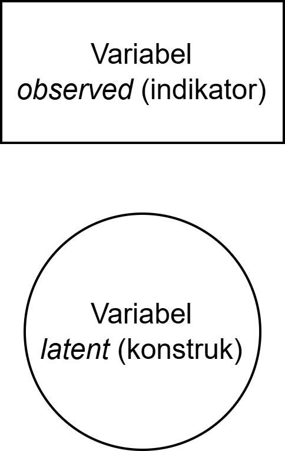
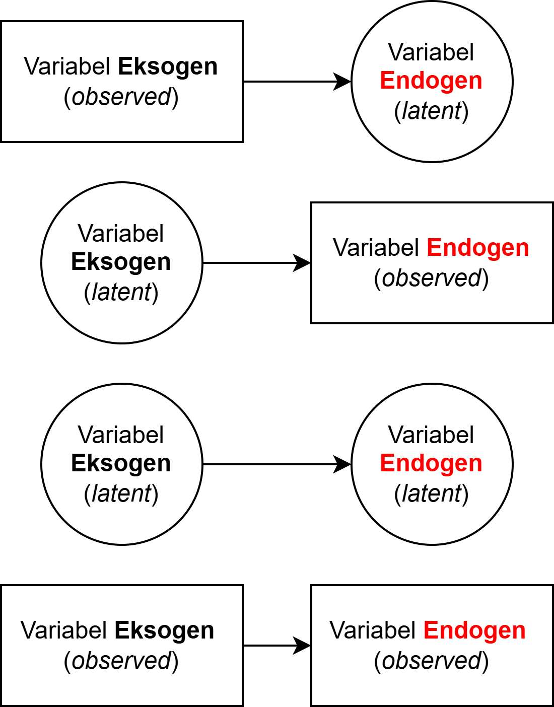
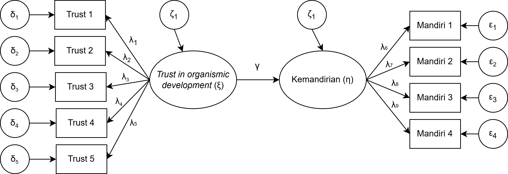
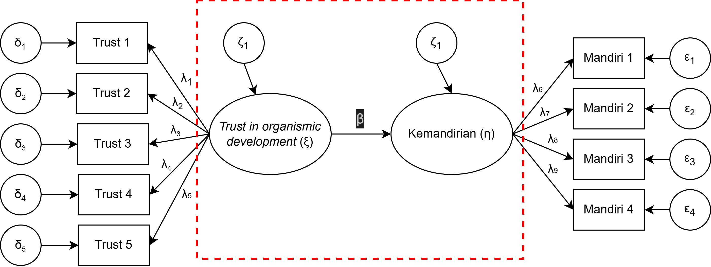
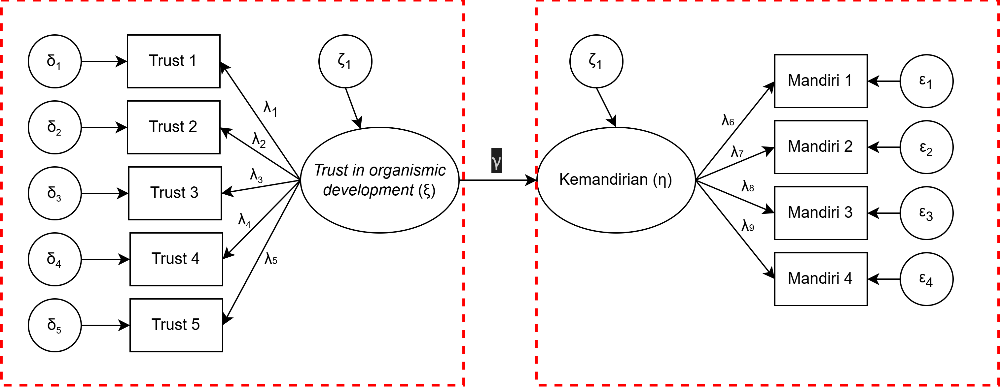
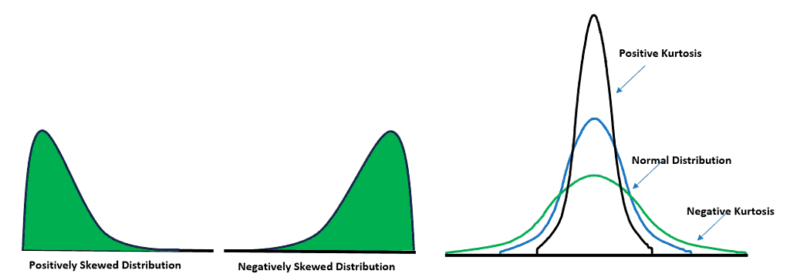
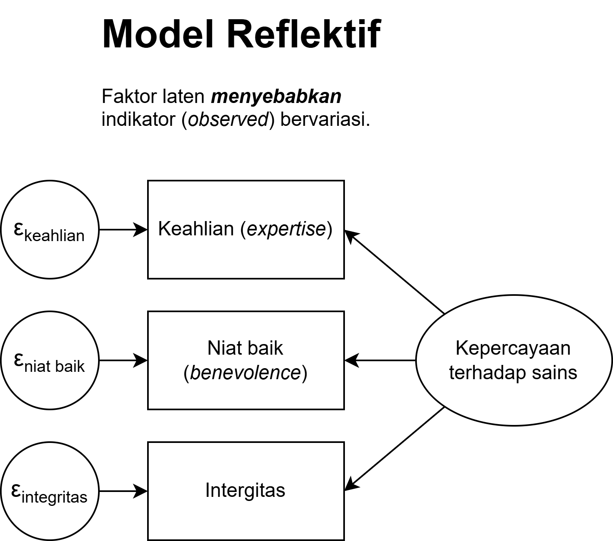
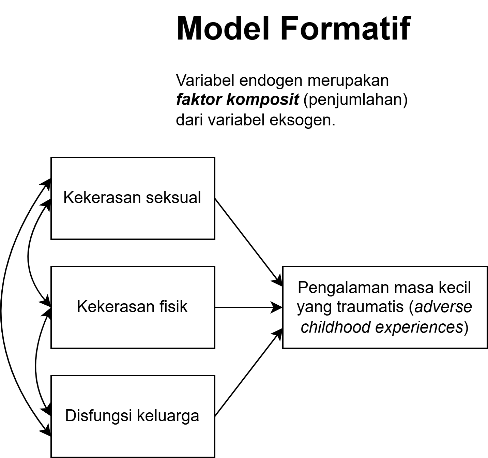

## *Outline* 

* Apa itu *structural equation modeling* (SEM)?
* Mengapa dan pada kondisi seperti apa SEM diperlukan?
* Beberapa pilihan perangkat lunak untuk mengeksekusi SEM
* SEM atau PLS?
* Yang tidak dicakup dalam *workshop* serta keterbatasan `jamovi`

# Apa itu structural equation modeling? {background-color="#14497F" .center}

## Penggunaan SEM <i class="fa-solid fa-trophy"></i>

::: {.incremental}
* Pernahkah ibu/bapak menggunakan SEM sebelumnya?
* Untuk apa SEM digunakan?
:::

## SEM adalah... 1️⃣

::: {.incremental}
* Model yang mencakup **hubungan** antara _observed_ dan _latent variables_ dalam berbagai bentuk model teoritis. 

* SEM memungkinkan peneliti untuk melakukan **pengujian hipotesis** yang berkaitan dengan model tersebut.

* Model SEM mengasumsikan (hipotesis) bahwa seperangkat variabel (*observed*) mendefinisikan sebuah konstruk **laten**, dan menggambarkan bagaimana hubungan antara konstruk-konstruk laten ini.

* SEM adalah teknik yang lebih *sophisticated* untuk menggambarkan **hubungan antar-variabel** karena mengontrol ***error* pengukuran** dari estimasi korelasi.

:::

## SEM adalah... 2️⃣

* Tujuan SEM adalah untuk mengetahui apakah model teoritik yang diuji peneliti **didukung oleh data**
  - Apabila data memberikan **bukti yang mendukung** bahwa hubungan antar konstruk/variabel terjadi, maka **mungkin** hubungan tersebut memang benar-benar ada di populasi.
  - Apabila data **tidak memberikan bukti yang mendukung** korelasi yang dihipotesiskan, maka peneliti dapat melakukan **re-spesifikasi model** dan menguji kembali model yang sudah dire-spesifikasi tersebut, atau **menyusun ulang model yang baru** untuk kemudian diuji kembali.

::: {.callout-warning}
#### Penting
SEM adalah teknik yang _theory-driven_ sehingga modifikasi/re-spesifikasi model harus memiliki alasan teoritis.
:::

## Jenis-jenis variabel dalam model SEM 1️⃣

:::: {.columns}
::: {.column}

::: {.incremental}
* **Variabel _observed_**
  - Variabel yang dapat diukur langsung dengan berbagai cara/strategi (e.g., *self-report*, *behavioral checklist*, dsb.).
  - Dalam pengukuran Psikologi, _item_ pernyataan (dalam skala Psikologi) adalah variabel _observed_.

* **Variabel _latent_**
  - Konstruk/variabel yang **tidak dapat diukur/diamati secara langsung**.
  - Oleh karena itu, membutuhkan variabel _observed_ untuk mengukurnya.
:::
:::

::: {.column}
{fig-align="right" width="60%"}
:::
::::

## Jenis-jenis variabel dalam model SEM 2️⃣

:::: {.columns}
::: {.column}

::: {.incremental}
* **Variabel eksogen** 
  - Variabel yang **hanya memberi** _direct effect_ pada variabel lain di dalam model yang sama
  
* **Variabel endogen** 
  - Variabel yang **hanya menerima** _direct effect_ pada variabel lain di dalam model yang sama
:::
:::

::: {.column}
{fig-align="center" width="80%"}
:::

::::

## Model SEM terdiri atas...

::: {.incremental}
* Model regresi (linear/OLS)
  - Menguji hubungan antar variabel *observed*

* Model jalur (*path model*)
  - Menguji hubungan antara dua (atau lebih) variabel *observed* dan *latent*
  - Bisa juga menguji hubungan antara dua (atau lebih) variabel *latent*
* Model pengukuran (*measurement model*/*confirmatory factor analysis*)
  - Menguji apakah item-item dari skala Psikologi (biasanya variabel *observed*) memang mengukur konstruk yang dihipotesiskan (biasanya variabel *latent*)  validitas konstruk.

* SEM biasanya mengandung setidaknya **dua model**, yaitu model pengukuran dan model struktural (regresi/jalur).
:::

## Contoh model SEM

{fig-align="center"}

## Model struktural

{fig-align="center"}

## Model pengukuran

{fig-align="center"}

# Mengapa SEM dilakukan? {background-color="#14497F" .center}

## Mengapa SEM?

::: {.incremental}
* Peneliti sudah memiliki kesadaran bahwa ia harus menyelidiki **beberapa variabel penelitian** secara bersamaan untuk menjawab pertanyaan penelitiannya.

* Ada kesadaran bahwa peneliti selama ini mengabaikan faktor *error* pengukuran. SEM membantu peneliti untuk **mengurangi efek *measurement error*** terhadap estimasi korelasi antar dua (atau lebih) variabel yang diteliti.

* Selama beberapa dekade kebelakang, SEM termasuk teknik analisis data yang sudah cukup **matang pengembangannya**, dan dapat mudah dilakukan dengan bantuan perangkat lunak.
:::

## Contoh aplikasi SEM

::: {.incremental}
* Seorang peneliti psikometri ingin **melihat efek latar belakang sosioekonomi terhadap kepribadian** partisipan dengan menggunakan pendekatan _Five-Factor Model_ (Big 5). Maka, jenis kelamin, tingkat pendidikan, dan item dalam skala kepribadian adalah _observed variable_, sedangkan dimensi dari Big 5 adalah _latent variable_.

* Seorang peneliti psikologi pendidikan ingin tahu apakah **kepercayaan orang tua bahwa anaknya dapat berkembang secara natural** (_trust in organismic development_ — _independent latent variable_) berkorelasi dengan **tingkat kemandirian anak** (_dependent latent variable_).

* Dalam konteks psikologi klinis, seorang psikolog klinis ingin tahu apakah **_personality trait_** (_independent latent variable_) dan status sosioekonomi (_observed independent variable_) dapat berdampak pada kecenderungan **depresi** dan **kecemasan** pada individu (_dependent latent variable_).

* Dalam sebuah penelitian psikologi sosial, peneliti ingin tahu apakah **_personality trait_** (_independent latent variable_) dapat menjelaskan mengapa orang **merespon pelanggaran moral** secara berbeda (_dependent latent variable_).
:::

## Perangkat lunak untuk mengeksekusi SEM

::: {.incremental}
* Perangkat lunak SEM sudah cukup *user-friendly*
  - `jamovi` dan `JASP` adalah perangkat lunak SEM yang hanya memerlukan *coding* yang sangat minimal.
  - Namun `jamovi` dan `JASP` fungsinya agak terbatas, karena tidak menyediakan opsi *power analysis* dan simulasi.
  - Selain itu, peneliti dapat menggunakan `Onyx`, `LISREL`, `SPSS AMOS`, `EQX`, `Mplus`, `STATA`, [`lavaan`](http://lavaan.ugent.be/tutorial/index.html) di  atau `semopy` di  dsb.
::: 

# Asumsi SEM {background-color="#14497F"}

## Asumsi SEM

::: {.callout-warning}
#### Penting
SEM merupakan teknik statistik yang _theory-driven_, sehingga asumsi teoritis yang melandasi model **jauh lebih penting** daripada asumsi statistiknya.
:::

::: {.incremental}

* Variabel endogen berdistribusi normal (_multivariate normality_)
* Korelasi antar variabel sifatnya linier

:::

## Normalitas data

* Mengapa distribusi variabel endogen **tidak berdistribusi normal?**
  - Bisa jadi **bentuk datanya ordinal/nominal**, sehingga kalau menggunakan skala *Likert*, maka kemungkinan besar distribusi data menjadi tidak normal.
  - Jumlah sampel **terlalu sedikit**.
  - Distribusi data yang tidak normal akan berdampak pada *variance-covariance matrix*.

{fig-align="center"}

## Apa yang harus dilakukan?

* Untuk **mengkoreksi distribusi data** yang juling (*skewness*), [***probit transformation***](http://methods.sagepub.com/Reference/the-sage-encyclopedia-of-educational-research-measurement-and-evaluation/i16518.xml) merupakan strategi yang terbaik.

* Untuk mengkoreksi *kurtosis* yang tidak sesuai, membutuhkan prosedur yang agak lebih rumit. 
  - Beberapa diantaranya adalah dengan menambah jumlah responden, melakukan estimasi *standard error* dengan metode *bootstrapping*
  - Bisa juga dengan menggunakan **metode estimasi model parameter** yang khusus untuk data yang tidak berdistribusi normal (e.g., _robust methods_ seperti [_robust maximum likelihood_ (ML)](http://doi.apa.org/getdoi.cfm?doi=10.1037/met0000093), atau [*weighted least squares*](https://link.springer.com/article/10.3758/s13428-015-0619-7)).

::: {.callout-caution}
#### Hati-hati
Estimator _weighted least squares_ biasanya membutuhkan jumlah sampel lebih besar.
:::

## SEM atau PLS? 1️⃣

::: {.incremental}
* _Covariance-based_ SEM (yang kita pelajari saat ini) merupakan teknik statistik yang mengestimasi parameter model dengan cara meminimalisasi diskrepansi antara data (_observed covariance matrix_) dengan spesifikasi model yang dihipotesiskan (_implied model_).
* CB-SEM berakar dari tradisi **_common factor theory_**, bahwa variabel **laten** (konstruk psikologis) _yang menyebabkan_ indikator (item di skala psikologis) bervariasi, dan indikator-indikator ini berbagi varians **_hanya melalui_** variabel laten tsb.
* CB-SEM menggunakan model pengukuran **reflektif**.
* Mayoritas konstruk psikologi menggunakan model pengukuran **reflektif**, bukan formatif.
:::

## SEM atau PLS? 2️⃣

::: {.incremental}
* _Partial least squares_ (PLS) mengestimasi skor variabel endogen dengan asumsi bahwa variabel endogen adalah _weighted composite_, kemudian melakukan regresi atas komposit-komposit tersebut satu sama lain.
* Asumsi PLS **_sangat berbeda_** dengan CB-SEM - variabel endogen adalah **komposit** bukan faktor laten.
* PLS menggunakan model pengukuran **formatif**.
* PLS sering "dijual" sebagai teknik alternatif dari CB-SEM yang "lebih praktis" karena bisa dieksekusi dengan sampel kecil, mampu menangani variabel endogen yang tidak berdistribusi normal, atau ketika menangani model yang sangat kompleks.
* Padahal sebenarnya, CB-SEM dan PLS adalah dua teknik dengan **_asumsi ontologis yang berbeda_** ([Rönkkö & Everman, 2013](https://doi.org/10.1177/1094428112474693); [Henseler, et al., 2014](https://doi.org/10.1177/1094428114526928)), sehingga membandingkan kedua teknik ini saja sudah sangat **tidak tepat** ([Rigdon et al., 2017](https://www.jstor.org/stable/26426850)).
:::

## Reflektif vs. Formatif

::: {.columns}
::: {.column}

{fig-align="center"}

:::
::: {.column}

{fig-align="center"}

:::
:::

Selengkapnya, baca di materi [_confirmatory factor analysis_](https://rameliaz.github.io/mg-sem-workshop/slides/bagian-4.html).

# Cakupan workshop {background-color="#14497F" .center}

## Yang tidak dicakup oleh *workshop* ini

* _Exploratory factor analysis_ (EFA)
* _A priori power analysis_, Monte Carlo _simulation_, dan _accuracy in parameter estimation_ (AIPE) untuk merencanakan jumlah sampel
* _Sensitivity analysis_ untuk SEM
* _Mixture model_ (SEM untuk desain penelitian longitudinal)  [_latent growth curve_](https://www.ncbi.nlm.nih.gov/pmc/articles/PMC2888524/)
* Model SEM dengan _missing data_
* Model SEM dengan variabel moderator/mediator
* Model SEM ketika variabel eksogen (indikator) _dichotomous_
* _Hierarchical latent variable model_ (_second-order_ CFA)
* [_Exploratory_ SEM (ESEM)](http://www.annualreviews.org/doi/10.1146/annurev-clinpsy-032813-153700)
* _Partial least square_ (PLS)
* [_Multiple indicators, multiple causes_ model (MIMIC)](https://journals.sagepub.com/doi/10.1177/23328584251388032)

## Ada pertanyaan❓

{fig-align="center"}

::: {.callout-note}
* Paparan disusun dengan menggunakan  dan [**Quarto**](https://quarto.org) dengan *template* dari [UNAIR Theme](https://github.com/rameliaz/quarto-unair-theme).
* Kontak saya via <i class="fas fa-paper-plane"></i> <a href="mailto:amelia.zein@psikologi.unair.ac.id">amelia.zein@psikologi.unair.ac.id</a>
:::