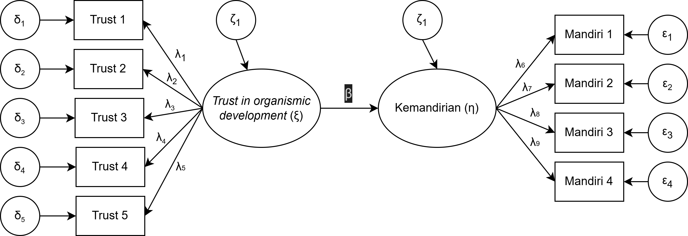
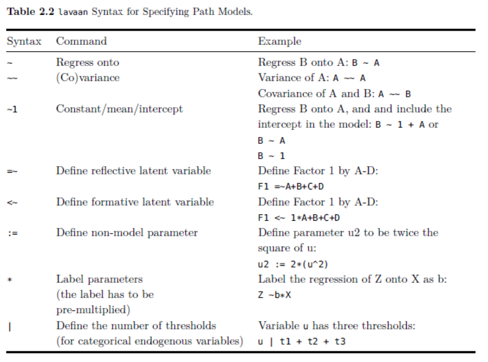
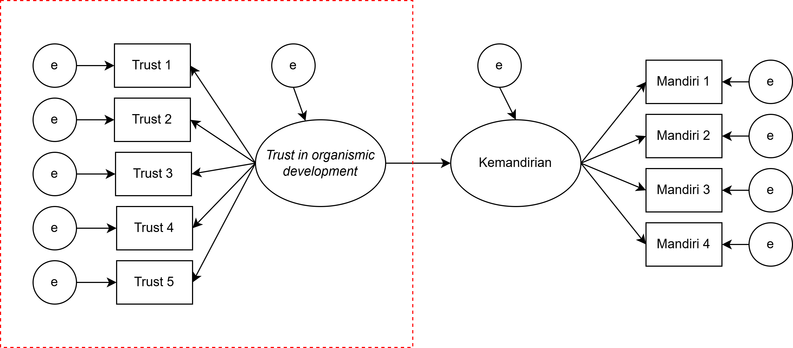
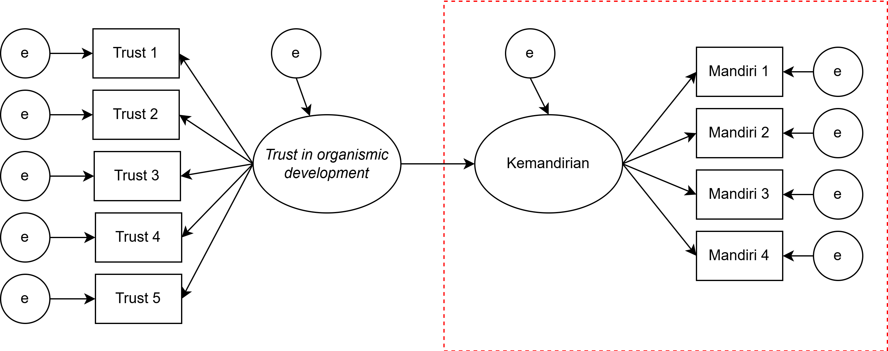
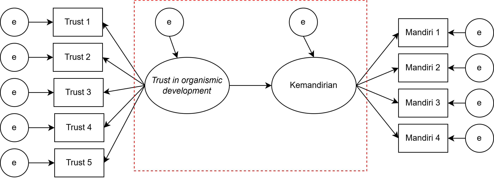

## _Outline_

* Definisi *path model*
* Asumsi kausalitas
* Nama variabel dan koefisien jalur (*path coefficients*)
  * δ (delta), ε (epsilon), ξ (ksi), η (eta), λ (lambda), γ (gamma), β (beta), φ (phi), ζ (zeta)
* Representasi visual model jalur menggunakan diagram jalur (*path diagram*)
* Menggambarkan hubungan antar-variabel dengan menggunakan diagram jalur
* *Script* `lavaan` untuk spesifikasi model jalur

## Analisis jalur

::: {.incremental}

* *Path model* merupakan kelanjutan dari model regresi karena terdiri dari **beberapa model regresi** sekaligus dapat digunakan untuk menguji *direct*, *indirect*, dan *correlated effects*.

* *Path model* disusun secara visual dengan aturan tertentu, yang mengikuti konsensus
  - Garis satu arah menggambarkan *direct effects*, yang merefleksikan *keterkaitan langsung* antara satu variabel dengan variabel lainnya. Asumsinya, **tidak ada variabel lain diluar model** yang berkorelasi dengan variabel tersebut.
  - Garis dua arah menggambarkan *covariance*/korelasi, yang mengimplikasikan bahwa keterkaitan antar-variabel masih mungkin ditentukan oleh **variabel lain yang tidak ada di dalam model**.
  - Garis *error terms* yang menunjukkan varians *observed variable* yang menjelaskan **variabel lain yang tidak dapat dijelaskan/di luar model**, yang juga mewakili ***measurement error***.

:::

## Diagram jalur

{fig-align="center" width="40%"}

## Korelasi = kausalitas?

* Analisis jalur sebenarnya adalah **bentuk yang lebih *sophisticated*** dari korelasi, sehingga

::: {.callout-important}
#### Penting diingat

**Correlation does not imply causation**
:::

Yang harus dipenuhi sebagai bukti kausalitas (X <i class="fa-solid fa-circle-arrow-right"></i> Y):

* Ada **urut-urutan waktu kejadian** (*temporal order*) <i class="fa-solid fa-circle-arrow-right"></i> desain penelitian *panel*/*longitudinal*/*time series*
* Adanya **korelasi** antara kedua variabel
* Peneliti harus melakukan **kontrol** atas variabel lain (_confounding_)
  - ...yaitu dengan cara melakukan **manipulasi** (_random assignment_) pada prediktor (X)

## Ilustrasi _use case_

:::: {.columns}
::: {.column width="70%"}

Marimar adalah seorang wali murid di sebuah PAUD di Kota Surabaya. Pada suatu hari, ia mengamati seorang anak (dan orangtua) yang perilakunya menarik perhatiannya.

Ibu anak tersebut bersikeras untuk menunggui anaknya di sekolah, padahal guru kelas meminta agar Ibu pulang saja, mempercayakan anak pada guru, dengan tujuan melatih kemandirian anaknya.

Melihat ibunya yang menggerutu karena diminta bu Guru pulang, si anak menangis meraung-raung tidak mau ditinggalkan. Akhirnya, terpaksa bu Guru membiarkan si Ibu menunggu di sekolah.

Marimar heran sekaligus penasaran, mengapa tiap anak **memberikan respon yang berbeda** ketika ditinggal orangtuanya di sekolah. Ada yang menangis meraung-raung, ada yang lebih santai dengan langsung bermain. Apakah ada kaitan antara kemandirian anak dengan karakteristik orangtuanya?

:::
::: {.column width="30%"}


:::
::::

## Variabel yang diukur Marimar

* **trust** (variabel independen) = Kepercayaan ibu bahwa perkembangan anak dapat berlangsung secara natural ([**trust in organismic development**](https://link.springer.com/article/10.1007/s11031-008-9092-2)). 
  - Makin tinggi skor, ibu makin percaya anaknya bisa berkembang secara natural. 
  - Diukur dengan skala *likert* yang terdiri dari 5 _item_ dengan 7 pilihan respon <i class="fa-solid fa-circle-arrow-right"></i> dari **sangat tidak setuju** sampai **sangat setuju**.

* **mandiri** (variabel dependen) = Tingkat kemandirian anak. Anak dengan skor yang tinggi semakin menunjukkan independensi dan lebih santai ketika ditinggal orangtuanya di sekolah. Beberapa indikator perilakunya adalah:
  - Tidak menangis ketika ditinggal orangtuanya
  - Tidak merengek atau merajuk ketika ditinggal
  - Masuk ke dalam kelas tanpa ditemani
  - Menaruh tas dalam loker yang disediakan tanpa bantuan orangtua

## Bagaimana bentuk diagram jalurnya?

{fig-align="center"}

## Nama variabel dan koefisien jalur

| Nama Variabel/Koefisien | Huruf Yunani | Huruf Latin |
| :-------------------------------------- | :------------: | :----------: |
| Variabel eksogen | ξ | Ksi |
| Variabel endogen | η | Eta |
| *Error* pengukuran dari variabel X | δ | Delta |
| *Error* pengukuran dari variabel Y | ε | Epsilon |
| *Direct effect* antara variabel laten dan indikatornya (*loading factor*) | λ | Lambda |
| *Direct effect* antara variabel endogen dan eksogen | γ | Gamma |
| *Direct effect* antara dua variabel laten **endogen** | β | Beta |

: {tbl-colwidths="[70,15,15]"}

## Nama variabel dan koefisien jalur

| Nama Variabel/Koefisien | Huruf Yunani | Huruf Latin |
| :-------------------------------------- | :------------: | :----------: |
| Korelasi (*covariance*) antara dua variabel laten **eksogen** | φ | Phi |
| Residual/*disturbance* dari variabel laten endogen (varians yang tidak dijelaskan oleh prediktornya) | ζ | Zeta |

: {tbl-colwidths="[70,15,15]"}

## Contoh model dengan koefisien jalur

{fig-align="center" width="100%"}

## Latihan mandiri 2️⃣: Membuat diagram jalur

:::: {.columns}
::: {.column width="70%"}
Fernando Jose sebal sekali karena ia kembali kehilangan pengokotnya dan ini kali ketiga ia kehilangan pengokot yang baru dibelinya seminggu yang lalu.

Teman-teman kerjanya memang punya kebiasaan buruk meminjam barang tanpa seijinnya. Ia akhirnya bertanya, apa ya yang menyebabkan teman-temannya berperilaku seperti itu?

Akhirnya ia menduga, mungkin ada kaitannya dengan faktor kepribadian (_conscientiousness_) dan faktor situasional di tempat kerjanya.

Untuk faktor situasi, ia mengamati sepertinya persepsi atas kondisi kerja yang informal dan relasi formal antara senior-junior mungkin juga berkaitan dengan timbulnya perilaku tersebut.
:::

::: {.column width="30%"}

:::
::::

## Yang diukur 📏

* **con** = Kecenderungan *conscientiousness* karyawan. Makin tinggi skornya, karyawan lebih mungkin menunjukkan kehati-hatian dan keteraturan dalam bekerja. Diukur dengan skala *Likert* berisi 6 _item_ dengan 10 pilihan jawaban.

* **incivil** = Intensitas perilaku tidak beradab. Makin besar skornya, karyawan akan lebih mungkin *emotionally abusive*, suka mengambil barang teman tanpa ijin, dan perilaku tidak pantas yang lain. Diukur dengan skala *Likert* berisi 4 _item_ dengan 10 pilihan jawaban.

* **usia** = Usia partisipan

::: {.callout-note}
#### Tugas Mandiri
Rumuskan **hipotesis** penelitiannya kemudian buatlah **diagram jalur** beserta **koefisien jalurnya**. 
Anda bisa menggunakan MS Power Point atau *software* yang lain (misalnya, [draw.io](https://app.diagrams.net/) atau [Canva](https://www.canva.com/)).
:::

#### [Klik disini untuk mengumpulkan tugas](https://padlet.com/ameliazein/tugas-mandiri-workshop-multigroup-sem-8p34daek2641aic8)

## `lavaan` *Script*

::: {.incremental}

* [`SEMLj`](https://semlj.github.io/) menyediakan dua opsi: fitur _script_ atau _interactive_
  - Kalau memilih fitur _interactive_, maka tampilan antarmukanya berupa _drag & drop_ (seperti `SPSS`).
  - Untuk fitur _script_, maka tampilan antarmukanya meminta pengguna untuk menspesifikasi model dengan _script_.

* `jamovi` dan `JASP` mengadopsi *script* dari <i class="fa-brands fa-r-project"></i> *package* [`lavaan`](http://lavaan.ugent.be/tutorial/index.html), sehingga untuk menspesifikasi model, kita harus memasukkan **serangkaian perintah**.

* Meskipun begitu, *script* `lavaan` **sangat sederhana** dan familiar dengan *script* `lavaan` memberikan **banyak keuntungan**.

* Menjalankan perintah dengan *script* juga membantu peneliti untuk mereka-ulang hasil analisis datanya, serta mempermudah kolaborasi dengan peneliti yang terbiasa menggunakan perangkat lunak yang berbeda dengan kita.

* Oleh karena itu, dalam _workshop_ ini peserta juga harus berlatih menulis _script_.

:::

## Dasar *script* `lavaan`

{fig-align="center" width="55%"}

::: {.aside}
Baujean, A.A. (2014). Latent Variable Modeling Using R: A step-by-step guide. New York: Routledge.
:::

## Contoh CFA 1️⃣

{fig-align="center" width="80%"}

```{r}
#| eval: false

# CFA
trust =~ trust1 + trust2 + trust3 + trust4 + trust5

# Measurement error (residual)
# Residual biasanya sudah langsung diestimasi oleh software tanpa harus dispesifikasikan secara eksplisit
trust1 ~~ trust1
trust2 ~~ trust2
trust3 ~~ trust3
trust4 ~~ trust4
trust5 ~~ trust5
trust ~~ trust
```

## Contoh CFA 2️⃣

{fig-align="center" width="80%"}

```{r}
#| eval: false

# CFA
mandiri =~ mandiri1 + mandiri2 + mandiri3 + mandiri4

# Measurement error (residual)
# Residual biasanya sudah langsung diestimasi oleh software tanpa harus dispesifikasikan secara eksplisit
mandiri1 ~~ mandiri1
mandiri2 ~~ mandiri2
mandiri3 ~~ mandiri3
mandiri4 ~~ mandiri4
mandiri ~~ mandiri
```

## Contoh *path analysis*

{fig-align="center" width="80%"}

```{r}
#| eval: false

# Model Struktural
mandiri ~ trust

# Measurement error (residual)
# Bagian ini biasanya sudah langsung diestimasi oleh software tanpa harus dispesifikasikan secara eksplisit
mandiri ~~ mandiri
trust ~~ trust
```

## Contoh *full model*

{fig-align="center" width="80%"}

```{r}
#| eval: false

# CFA
mandiri =~ mandiri1 + mandiri2 + mandiri3 + mandiri4
trust =~ trust1 + trust2 + trust3 + trust4 + trust5

# Model Struktural
mandiri ~ trust

# Measurement error (residual)
# Residual biasanya sudah langsung diestimasi oleh software tanpa harus dispesifikasikan secara eksplisit
mandiri1 ~~ mandiri1
mandiri2 ~~ mandiri2
mandiri3 ~~ mandiri3
mandiri4 ~~ mandiri4
trust1 ~~ trust1
trust2 ~~ trust2
trust3 ~~ trust3
trust4 ~~ trust4
trust5 ~~ trust5
trust ~~ trust
mandiri ~~ mandiri
```

## Latihan mandiri 3️⃣: Menulis *script* `lavaan`

Tulislah *script* `lavaan` dari diagram jalur yang sudah dibuat di Latihan mandiri 2️⃣

#### [Klik disini untuk mengumpulkan tugas](https://padlet.com/ameliazein/tugas-mandiri-workshop-multigroup-sem-8p34daek2641aic8)

## Ada pertanyaan❓

{fig-align="center"}

::: {.callout-note}
* Paparan disusun dengan menggunakan <i class="fa-brands fa-r-project"></i> dan [**Quarto**](https://quarto.org) dengan *template* dari [UNAIR Theme](https://github.com/rameliaz/quarto-unair-theme).
* Kontak saya via <i class="fas fa-paper-plane"></i> <a href="mailto:amelia.zein@psikologi.unair.ac.id">amelia.zein@psikologi.unair.ac.id</a>
:::
