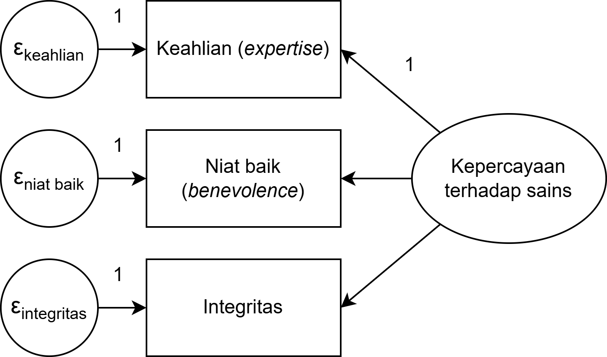
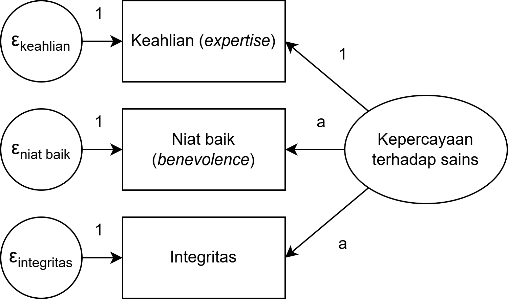
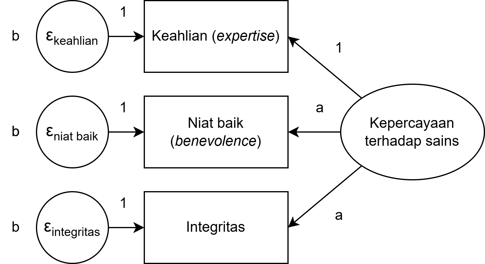
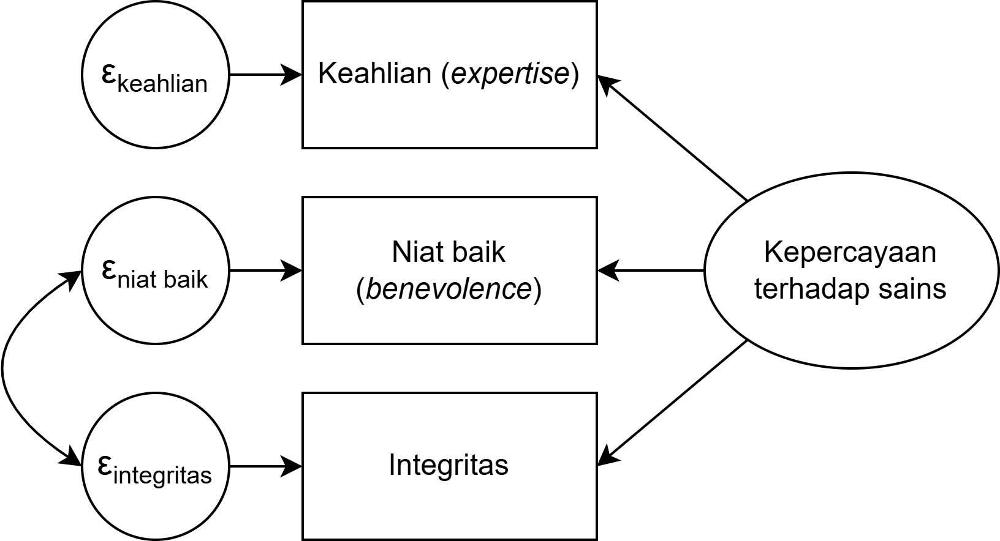

## _Outline_

* Definisi *factor analysis*
* *Exploratory* vs *confirmatory factor analysis*
* Kapan menggunakan CFA?
* [*Constraining parameter* model](https://psycnet.apa.org/record/2008-06808-005)
* Model pengukuran (paralel, *tau equivalence*, dan *congeneric*)
* Variabel indikator (reflektif vs formatif)
* *Correlated error variances*
* Metode estimasi
* *Average Variance Extracted* (AVE) dan validitas diskriminan
* Menuliskan hasil analisis CFA dalam laporan penelitian

## Analisis faktor

::: {.columns}
::: {.column width="50%"}
::: {.incremental}

* Awalnya dikembangkan oleh Charles Spearman (1904) untuk menyelidiki [*g factor theory of intelligence*](https://en.wikipedia.org/wiki/G_factor_(psychometrics))

* Terdiri dari:
  - *Exploratory factor analysis* (EFA)
  - *Confirmatory factor analysis* (CFA)

* Analisis faktor digunakan untuk menguji model *common variance*

* Mengasumsikan bahwa dua atau lebih *observed variable* memiliki *shared/common variance* (*commonality* atau *common factor*)  ditunjukkan dengan ***factor loading***

:::
:::
::: {.column width="50%"}


:::
:::

## EFA vs. CFA

| Exploratory Factor Analysis | Confirmatory Factor Analysis |
| :--- | :--- |
| Mencari model yang cocok menggambarkan data, sehingga peneliti **mengeksplorasi berbagai pilihan model** yang cocok kemudian mencari rasionalisasi teoritisnya | Menguji hipotesis yang **sudah ditentukan sebelumnya**, sehingga peneliti ingin tahu apakah hipotesisnya didukung oleh data |
| Jumlah faktor belum diketahui sampai peneliti melakukan analisisnya | Jumlah faktor sudah ditentukan sebelum mengambil data |
| Peneliti **tidak memiliki** model yang dihipotesiskan *a priori* | Peneliti **sudah memiliki** model hipotesis yang ditentukan *a priori* |

: {tbl-colwidths="[50,50]"}


## *Confirmatory factor analysis*

::: {.incremental}

* Menyediakan solusi untuk mengkoreksi bias karena *measurement error* ketika mengestimasi korelasi antar-variabel

* Cara kerjanya adalah dengan membandingkan *variance-covariance matrix* yang dihipotesiskan dengan *variance-covariance matrix* pada data (sampel)

* **Perhatian** 📢
  - **Sangat tidak disarankan** untuk melakukan EFA kemudian CFA pada **sampel yang sama**
  - Karena *generating hypothesis* dengan *testing hypothesis* adalah dua proses yang berbeda yang **tidak seharusnya** dilakukan pada sampel yang sama
  - Kalau hal tsb dilakukan, maka tentu saja peneliti akan mendapatkan hasil yang 'sesuai prediksinya'
  - Ingat [Texas Sharpshooter Fallacy](https://en.wikipedia.org/wiki/Texas_sharpshooter_fallacy)

:::

## _Texas sharpshooter fallacy_

{fig-align="center"}

## [*Constraining parameter* model](https://psycnet.apa.org/record/2008-06808-005)

::: {.incremental}

* **Membatasi/menentukan varians** untuk setiap **variabel/faktor laten**
  - Dilakukan untuk mengeluarkan ***standardized estimates***
  - *Factor loading* di *z-score*kan
  - Sehingga *default*nya, *mean* variabel laten = 0, *variance* = 1

* Membatasi/menentukan ***error covariance*** untuk setiap variabel/faktor laten = 0
  - Dilakukan agar *error variance* bebas diestimasi

:::

## Jenis-jenis model pengukuran

Ada tiga macam model pengukuran:

* Model _congeneric_
* Model _tau equivalence_
* Model _parallel_

## Model _congeneric_

:::: {.columns}
::: {.column}
::: {.incremental}

* Model yang paling moderat dan *default* di berbagai perangkat lunak SEM
* Asumsinya, **skala, *error variance*, dan *factor loading* boleh berbeda (dibebaskan)**
* **Koefisien reliabilitas skala** yang mengasumsikan model pengukuran *congeneric*  ω, McDonald's ω, ω total (ω~*t*~), Revelle's ω, *composite reliability*.

:::
:::
::: {.column}

{fig-align="center"}

:::
::::

## Model _tau equivalence_

:::: {.columns}
::: {.column}
::: {.incremental}

* Model yang sedikit lebih rigid daripada *congeneric*
* Asumsinya, **skala dan *error variance* boleh berbeda (dibebaskan)**, namun ***factor loading* harus sama (dibatasi)**
* Ketika asumsi *tau equivalence* dipenuhi, maka [Cronbach's α dapat digunakan](https://www.ncbi.nlm.nih.gov/pubmed/28557467)
* **Koefisien reliabilitas**: Formula Rulon, KR-20, Flanagan-Rulon, Guttman's λ~3~, λ~4~, Hoyt *method*
  - Pada kebanyakan kasus, jarang sekali ada kosntruk psikologi yang memenuhi asumsi _tau equivalence_, sehingga **sangat disarankan** untuk tidak menggunakan koefisien reliabilitas yang mengasumsikan _tau equivalence_

:::
:::
::: {.column}

{fig-align="center"}

:::
::::

## Model _parallel_  

:::: {.columns}
::: {.column}

* Model yang paling rigid
* Asumsinya, **skala, *error variance*, dan *factor loading* harus sama (dibatasi)**
  - **Koefisien reliabilitas**: Spearman-Brown's Formula, Standardized α.
:::
::: {.column}

{fig-align="center"}

:::
::::

## Model Reflektif vs. Formatif

::: {.incremental}

* Reflektif
  - **Variabel laten menjelaskan** mengapa **variabel indikator bervariasi**
  - Misalnya  individu dengan intelegensi yang tinggi akan mendapatkan nilai yang berbeda dalam tes matematika
  - Biasanya mengasumsikan bahwa **korelasi antar-variabel indikator = 0**  artinya, tiap indikator mengukur aspek yang unik dari variabel laten, tidak tumpang tindih
  - Mayoritas konstruk psikologis mengasumsikan model pengukuran reflektif

* Formatif
  - **Variabel *observed* menjelaskan** mengapa **variabel laten bervariasi**
  - Misalnya  gengsi sebuah mobil ditentukan oleh usia mobil, kondisi, harga, dan intensitas pemakaian
  - Korelasi antara variabel *observed* tidak diketahui
  - Biasanya digunakan untuk menentukan indeks pada konstruk yang *orthogonal* (contoh  kepribadian pada *Five Factor model*)
  - Tetapi, **sangat jarang** konstruk psikologi yang mengasumsikan model formatif

:::

## Model Reflektif

{fig-align="center"}

## Model Formatif

{fig-align="center" width="60%"}

## Apa yang terjadi ketika *error variance* berkorelasi?

{fig-align="center"}

* Kedua variabel indikator tersebut mengukur variabel laten lain di luar model (*unique factor*)
* Bisa jadi karena ada _item_ *unfavourable* dalam skala
* Kemungkinan konstruk laten **bukan konstruk tunggal** (multidimensi)
* Perhatikan justifikasi teori ketika menambah *error covariance*

## Skor faktor (*factor scores*)

::: {.incremental}

* Apabila kita memiliki informasi tentang *factor loading*, maka kita bisa menghitung *factor scores*  **estimasi** (*fitted*) skor variabel laten

* Caranya dengan mengali *factor loading* dengan skor kasar  metode regresi

* Namun ingat, mengalikan *factor loading* dengan skor kasar **masih berisiko mendapatkan estimasi yang bias**. Itulah yang menyebabkan *factor scores* akan berubah ketika model diujikan pada kelompok sampel yang berbeda.

* Ada tiga cara yang bisa digunakan untuk menghitung *factor scores*:
  - **Metode Regresi**  dengan mengoptimalisasi validitas konstruk (*variance explained*)
  - **Metode Bartlett**  mengasumsikan variabel indikator **tidak saling berkorelasi**
  - **Metode Anderson-Rubin**  mengasumsikan variabel indikator **saling berkorelasi**

:::

## Memilih metode estimasi

::: {.incremental}

* *Maximum Likelihood*  distribusi data (*multivariate*) normal, level pengukuran harus interval/*continuous*, tidak ada data *missing*
  - Gunakan _Robust Maximum Likelihood_ (MLR) ketika asumsi _multivariate normality_ tidak terpenuhi

* *Generalized-least squares*  menggunakan asumsi yang sama dengan `ML` namun performanya kurang baik apabila dibandingkan dengan `ML`

* *Weighted-least squares*  dapat digunakan pada data kategorikal (nominal dan ordinal), estimasi menggunakan *polychoric correlation matrix*. Varian WLS, misalnya: WLSM, WLSMV, WLSMVS.

* *Diagonally weighted-least squares*  dapat digunakan pada data kategorikal, bekerja dengan baik pada sampel yang relatif kecil dan data yang tidak berdistribusi normal

:::

::: {.callout-tip}
#### Tips memilih estimator
Untuk **skala _Likert_ dengan 6–7 pilihan**, dengan respons yang relatif simetris, **MLR sudah baik performanya**. Untuk **skala _Likert_ 4 pilihan** dengan distribusi yang sangat juling (_skew_), **WLSMV merupakan pilihan yang lebih aman** ([Rhemtulla, Brosseau-Liard & Savalei](https://psycnet.apa.org/record/2012-18631-001), 2012).
:::

## *Average Variance Extracted* (AVE)

::: {.incremental}

* AVE mengukur **seberapa besar varians pada variabel indikator yang dijelaskan oleh faktor laten**, dibandingkan dengan varians yang berasal dari *error*

* Formula AVE (dengan λᵢ = *standardized factor loading* tiap indikator):

$$AVE = \frac{\sum \lambda_i^2}{\sum \lambda_i^2 + \sum (1 - \lambda_i^2)}$$

* Intinya: dari seluruh varians indikator, berapa proporsinya yang merupakan benar-benar "sinyal" dari konstruk dan bukan *noise*?

* **Kriteria**  AVE ≥ 0.50 ([Fornell & Larcker, 1981](https://doi.org/10.2307/3151312))
  - AVE < 0.50 berarti *error variance* lebih besar daripada *construct variance*  validitas konvergen **tidak terpenuhi**

:::

## AVE vs. *Composite Reliability* (CR)

| | AVE | *Composite Reliability* |
| :--- | :--- | :--- |
| **Yang diukur** | Rasio sinyal-terhadap-total per indikator | Konsistensi internal skala |
| **Sensitif terhadap** | *Loading* rendah sangat menekan nilai AVE | Kurang sensitif — *loading* tinggi dapat mengompensasi |
| **Kriteria** | ≥ 0.50 | ≥ 0.70 |
| **Kegunaan utama** | Validitas konvergen & diskriminan | Reliabilitas (alternatif Cronbach's α) |

: {tbl-colwidths="[30,35,35]"}

::: {.callout-warning}
#### CR tinggi belum tentu AVE tinggi
Skala dengan *loading* sedang (misalnya semua λ = 0.60, 5 item) bisa menghasilkan CR ≈ 0.78 namun AVE ≈ 0.36. CR fokus pada *"apakah item-item saling berkaitan?"*; AVE fokus pada *"apakah item-item benar-benar mewakili konstruknya?"*
:::

## Validitas Diskriminan: Kriteria Fornell-Larcker

::: {.incremental}

* Selain validitas konvergen, AVE juga digunakan untuk menguji **validitas diskriminan** — apakah setiap konstruk benar-benar berbeda dari konstruk lainnya

* **Kriteria Fornell-Larcker**: AVE setiap konstruk harus **lebih besar** dari kuadrat korelasi antara konstruk tersebut dengan konstruk lain mana pun

$$AVE_A > r^2_{AB} \quad \text{dan} \quad AVE_B > r^2_{AB}$$

* Artinya: konstruk A **berbagi lebih banyak varians dengan indikatornya sendiri** daripada dengan konstruk B

* Apabila kriteria ini tidak terpenuhi  kemungkinan dua konstruk terlalu mirip dan **tidak dapat dibedakan** secara empiris

:::

::: {.callout-tip}
#### Cara membaca tabel Fornell-Larcker
Letakkan √AVE tiap konstruk di diagonal tabel korelasi antar-konstruk. Validitas diskriminan terpenuhi apabila **nilai diagonal (√AVE) lebih besar dari semua nilai di baris dan kolom yang sama**.
:::

## Contoh Sintaks `lavaan`: Menghitung AVE

Setelah menjalankan model CFA, AVE dapat dihitung dari *standardized loading*:

```{r}
library(lavaan)

fit <- cfa(model, data = data_anda, estimator = "MLR")

# Ambil standardized loading
sl <- lavInspect(fit, "std")$lambda

# Hitung AVE per faktor
ave <- apply(sl, 2, function(x) {
  x2 <- x[x != 0]^2
  sum(x2) / (sum(x2) + sum(1 - x2))
})

ave
```

::: {.callout-note}
#### Tips
Paket `semTools` menyediakan fungsi `reliability()` yang menghitung AVE dan CR sekaligus dalam satu langkah.
:::

# Demonstrasi CFA {background-color="#14497F" .center}

[**Unduh Dataset Contoh CFA**](https://rameliaz.github.io/mg-sem-workshop/contoh-cfa.omv)

## Latihan mandiri 4️⃣: Mencoba *confirmatory factor analysis*

* Unduh [Dataset Latihan SEM](https://rameliaz.github.io/mg-sem-workshop/materials/dataset-pilpres2024.csv)

* Unduh [Kamus Data disini](https://rameliaz.github.io/mg-sem-workshop/materials/codebook-pilpres2024.csv)

* Lakukan CFA pada skala *social dominance orientation*
  - Diukur dengan skala *Likert*, 6 _item_ dengan 7 pilihan jawaban

* Laporkan *model fit*, *factor loading*, dan *multivariate normality*

* Lakukan penyesuaian apabila perlu

## Ada pertanyaan❓

{fig-align="center"}

::: {.callout-note}
* Paparan disusun dengan menggunakan  dan [**Quarto**](https://quarto.org) dengan *template* dari [UNAIR Theme](https://github.com/rameliaz/quarto-unair-theme).
* Kontak saya via <i class="fas fa-paper-plane"></i> <a href="mailto:amelia.zein@psikologi.unair.ac.id">amelia.zein@psikologi.unair.ac.id</a>
:::
