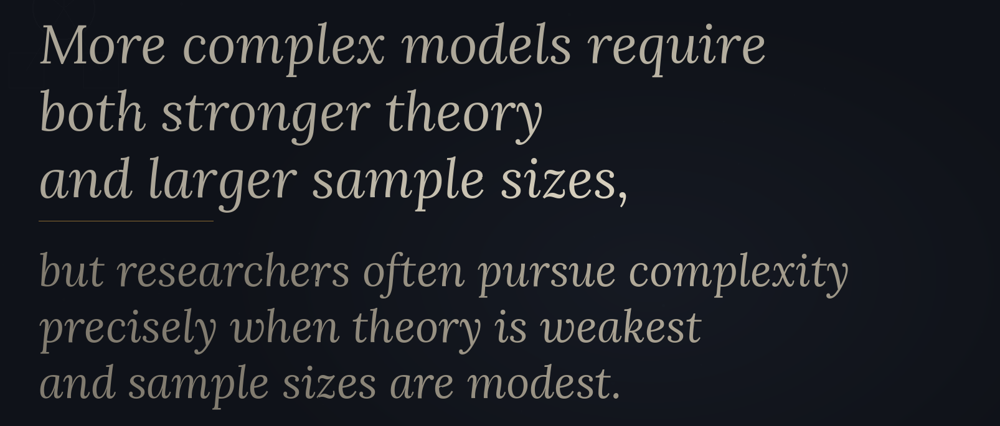

## _Outline_

* Dasar-Dasar SEM: Model struktural & pengukuran
* Tahapan *modeling* dengan menggunakan SEM
* *Degree of freedom*
* *Underidentified*, *just-identified*, dan *overidentified model*
* Jenis-jenis kriteria untuk menilai ketepatan model (*model fit*)
* Menguji hipotesis (*statistical power*, ukuran sampel)
* Membandingkan pendekatan dua-langkah vs empat-langkah
* Menuliskan hasil analisis SEM dalam laporan penelitian

## Pengantar SEM

::: {.incremental}

* SEM adalah *full model* <i class="fa-solid fa-circle-arrow-right"></i> menggabungkan **model pengukuran** dengan **model jalur/struktural**

* Ada beberapa pendekatan dalam SEM [(Jöreskog, 1993)](https://psycnet.apa.org/record/1993-97481-000)
  - ***Strictly confirmatory*** <i class="fa-solid fa-circle-arrow-right"></i> menguji apakah ***variance-covariance matrix*** yang dihipotesiskan (*implied*) sama dengan/didukung oleh data (***observed variance-covariance matrix***)

  - ***Alternative model*** <i class="fa-solid fa-circle-arrow-right"></i> menguji beberapa **model yang saling bersaing** (*competing models*) pada dataset yang sama, kemudian memilih yang paling baik menggambarkan data — model-model tersebut bisa berjenjang (*nested*) maupun tidak (*non-nested*)

  - ***Model generating*** <i class="fa-solid fa-circle-arrow-right"></i> dimulai dari model yang dihipotesiskan, kemudian **dimodifikasi secara iteratif** berdasarkan indikasi data (*specification search*) hingga *fit statistics* membaik

:::

::: {.callout-caution}
#### *Model generating* harus dilakukan dengan sangat hati-hati
Setiap modifikasi **harus dijustifikasi secara teori**, bukan semata-mata didorong oleh data. Pendekatan ini rentan terhadap [*capitalization on chance*](https://pubmed.ncbi.nlm.nih.gov/16250105/). Model yang tampak *fit* di satu sampel sering kali gagal direplikasi di sampel lain [(MacCallum, Roznowski & Necowitz, 1992)](https://pubmed.ncbi.nlm.nih.gov/16250105/). Apabila modifikasi dilakukan, **validasi hasilnya pada sampel yang berbeda**.
:::

## Langkah-langkah melakukan analisis SEM

::: {.columns}
::: {.column width="50%"}

::: {.incremental}
* Spesifikasi model

* Identifikasi model

* Estimasi model

* Menguji model

* Memodifikasi model
:::

:::
::: {.column width="50%"}


:::
:::


## Spesifikasi model

::: {.incremental}

* Peneliti menyusun model pengukuran dan model jalur dengan menggambar diagram jalur *path diagram*

* Dalam SEM, justifikasi teori adalah suatu yang **tidak bisa ditawar-tawar** karena tanpa basis teori yang kuat, *model testing* akan selalu memberikan hasil yang mengecewakan (*poor fit*)

* Sebelum melakukan SEM, peneliti sangat disarankan melakukan *preliminary study*, atau setidaknya *systematic review* yang dapat membantu peneliti menyusun hipotesis model yang baik

:::

## Identifikasi model

::: {.incremental}

* Model dapat diidentifikasi apabila ***degree of freedom* (*df*) ≥ 0**

* Apabila *df* = 0, maka model tsb adalah *saturated model* atau *just-identified model*
  - Jumlah **'informasi yang diketahui'** dan **'tidak diketahui'** sama persis
  - Tidak bisa difalsifikasi, hampir 'selalu tepat', tetapi 'selalu salah'

* Apabila *df* bernilai negatif, maka model tsb *under-identified* karena jumlah parameter jalur yang harus diestimasi lebih banyak daripada jumlah parameter di *variance-covariance matrix*
  - Lebih banyak **'informasi yang tidak diketahui'** daripada yang **'diketahui'**
  - Model 'misterius' 😄

* Model yang dapat diidentifikasi adalah *over-identified model* dimana **jumlah parameter *variance-covariance matrix* lebih banyak daripada jumlah parameter jalur yang diestimasi** (sehingga *df* ≥ 1)
  - Lebih banyak **'informasi yang diketahui'** daripada yang **'tidak diketahui'**

* *Degree of freedom* <i class="fa-solid fa-circle-arrow-right"></i> dihitung dengan mengurangi jumlah nilai unik (*non-redundant information*) dalam *variance-covariance matrix* dengan jumlah parameter jalur yang hendak diestimasi

:::

## _Over-identified model_

::: {.columns}
::: {.column width="50%"}

{fig-align="center"}

:::
::: {.column width="50%"}

* Pada model ini **jumlah nilai unik (*non-redundant information*)** dalam *variance-covariance matrix* = 5(5+1)/2 = 15

* Sedangkan **jumlah parameter jalur** yang akan diestimasi adalah 11 (5 *factor loading*, 6 *error variance*), sehingga

* *df* = 15-11 = 4 🥇

* Model **dapat diidentifikasi** karena memenuhi syarat (*over-identified*)

:::
:::

## _Under-identified model_

::: {.columns}
::: {.column width="50%"}

{fig-align="center"}

:::
::: {.column width="50%"}

* Pada model ini **jumlah nilai unik (*non-redundant information*)** dalam *variance-covariance matrix* = 3(3+1)/2 = 6

* Sedangkan **jumlah parameter jalur** yang akan diestimasi adalah 7 (3 *factor loading*, 4 *error variance*), sehingga

* *df* = 6-7 = -1 😢

* Model **tidak dapat diidentifikasi** karena tidak memenuhi syarat (*under-identified*)

:::
:::

## _Just-identified model_

::: {.columns}
::: {.column width="50%"}

{fig-align="center"}

:::
::: {.column width="50%"}

* Pada model ini **jumlah nilai unik (*non-redundant information*)** dalam *variance-covariance matrix* = 3(3+1)/2 = 6

* Sedangkan **jumlah parameter jalur** yang akan diestimasi adalah 6 (3 *factor loading*, 3 *error variance*), sehingga

* *df* = 6-6 = 0 😢

* Model **tidak dapat diidentifikasi** karena tidak ada ruang tersisa untuk melakukan estimasi (*just-identified*/*saturated model*)

:::
:::


## Kesimpulan 🏫

* Untuk satu faktor/variabel laten, kita perlu **sedikitnya 4 variabel indikator** karena apabila ≤3, maka model akan *just-identified* atau *under-identified*

* Tapi meskipun kita punya 4 variabel indikator untuk 1 variabel laten, kita masih mungkin memiliki model yang *just-identified*, ketika *error*nya berkorelasi

* Apakah bisa 1 variabel laten diukur oleh 1 *observed variable*?


## Variabel laten dengan 1 indikator

::: {.columns}
::: {.column width="50%"}

* Masih bisa diestimasi dengan asumsi

  - _Item_ diasumsikan memiliki [reliabilitas](https://www.ncbi.nlm.nih.gov/pmc/articles/PMC3475500/) sempurna, sehingga varians *error* di*constraint* = 0
  - Reliabilitas diukur dengan *test-retest*, kemudian varians *error* di*constraint* dengan mempertimbangkan reliabilitas dan standar deviasi

:::
::: {.column width="50%"}

{fig-align="center"}

:::
:::


## Mengestimasi & Menguji model

* Pilih **metode estimasi** yang paling cocok dengan karakteristik data (`ML`, `ULS`, `GLS`, `WLS`, `DWLS` atau *robust* `DWLS`)

* Metode estimasi ini yang akan menghitung *standard error* yang tepat sesuai dengan karakteristik model

* Apabila metode estimasi yang dipilih tidak tepat dan tidak sesuai dengan kompatibilitas datanya, maka estimasi *standard error* menjadi bias <i class="fa-solid fa-circle-arrow-right"></i> sehingga model parameter memberikan informasi yang menyesatkan

## Menguji ketepatan model

::: {.incremental}

* Umumnya peneliti ingin mendapatkan 3 informasi
  - ***χ² sebagai *global fit measure***. χ² menguji perbedaan antara *model-implied* dengan *sample covariance matrix*. 
  - Apabila *p-value* dari χ² ≥ α (dengan α=0.05), maka **tidak ada perbedaan** antara keduanya <i class="fa-solid fa-circle-arrow-right"></i> artinya, **data mendukung model**

  - ***p-value* dari *factor loading*** untuk setiap variabel dalam model

  - **Besar dan arah *factor loading*** - besar *factor loading* memberikan informasi mengenai *magnitude* dan kontribusi variabel tersebut dalam menjelaskan variabel lainnya. Sedangkan arah *factor loading* (positif/negatif) memberikan informasi mengenai arah hubungan.

:::

## Menguji ketepatan model: *Chi-square* (χ²)

::: {.columns}
::: {.column width="50%"}

* Dihitung dengan cara membandingkan **model yang dihipotesiskan (*implied model*)** dengan ***saturated model*** (model dengan *fit* sempurna, yang mana semua parameter dibebaskan tanpa *constraint*)
  - *Indeks inkremental* seperti CFI dan NFI-lah yang membandingkan *implied model* dengan *baseline*/*null model* (model tanpa jalur sama sekali)

* Umumnya, model dengan jumlah sampel yang besar akan memberikan hasil uji χ² yang signifikan, tetapi **uji χ² yang signifikan ini tidak boleh diabaikan** begitu saja❗

* Selain χ², kita bisa menggunakan *alternative fit indices* yang terdiri dari
  - *Incremental index*
  - *Parsimony index*
  - *Absolute (standalone) index*

:::
::: {.column width="50%"}


:::
:::

## *Incremental (comparative/relative) index*

* Didapatkan dengan membandingkan *implied model* dengan *baseline model*, meliputi
  - ***Comparative Fit Index*** <i class="fa-solid fa-circle-arrow-right"></i> mendekati 1 = *closer fit*

  - ***Normed Fit Index*** <i class="fa-solid fa-circle-arrow-right"></i> mendekati 1 = *better fit*

  - ***Incremental Fit Index*/*Bollen's Nonnormed Fit Index*** <i class="fa-solid fa-circle-arrow-right"></i> mendekati 1 = *better fit*

  - ***Tucker Lewis Index*/*Bentler-Bonnet Non-Normed Fit Index*** <i class="fa-solid fa-circle-arrow-right"></i> mendekati 1 = *better fit*


## *Parsimony index* 

* Indeks ini secara khusus memberikan pinalti pada kompleksitas model, yang meliputi:

* ***Expected Cross Validation Index*** <i class="fa-solid fa-circle-arrow-right"></i> digunakan untuk membandingkan dua model atau lebih. Nilai yang lebih kecil menunjukkan model yang lebih baik
* ***Information-Theoretic Criterion*** <i class="fa-solid fa-circle-arrow-right"></i> meliputi AIC, BIC, dan SABIC. Nilai yang kecil menunjukkan model yang lebih baik
* ***Noncentrality Parameter-based Index*** <i class="fa-solid fa-circle-arrow-right"></i> mendekati 1 = *better fit*
* ***McDonald's Noncentrality Index*** <i class="fa-solid fa-circle-arrow-right"></i> mendekati 1 = *better fit*
* ***Parsimonious Normed Fit Index*** <i class="fa-solid fa-circle-arrow-right"></i> NFI yang mempertimbangkan *parsimony* model, mendekati 1 = *better fit*
* ***Parsimony Goodness of Fit Index*** <i class="fa-solid fa-circle-arrow-right"></i> mendekati 1 = *better fit*

## *Absolute index* 1️⃣

* Indeks ini dihitung tanpa melakukan perbandingan dengan *baseline*, yang meliputi:

* ***Root Mean Square Error of Approximation* (`RMSEA`)** <i class="fa-solid fa-circle-arrow-right"></i> merupakan estimasi seberapa besar *approximation error* per *degree of freedom* yang diperkirakan terjadi di populasi — *close fit* ketika nilainya **< 0.05**, *acceptable fit* ketika **0.05 – 0.08**, *poor fit* ketika **> 0.10**
  - *p-value* dapat digunakan untuk menguji *H*~0~: `RMSEA` ≤ 0.05 (*close fit*)
  - Oleh karena itu, **gagal menolak *H*~0~** (*p* > 0.05) menunjukkan bahwa model "*close-fitting*"
  - `RMSEA` sangat dipengaruhi oleh kompleksitas model dan *sample size*, dan dapat menunjukkan *misfiting* bahkan untuk kesalahan spesifikasi yang kecil ketika sampelnya besar
* ***Standardized Root Mean Square Residual* (`SRMR`)** <i class="fa-solid fa-circle-arrow-right"></i> akar kuadrat dari rata-rata kuadrat selisih antara *observed* dan *model-implied correlation matrix*, nilai **< 0.08** menunjukkan *acceptable fit*
  - `SRMR` (vs. `RMSEA`) relatif kurang dipengaruhi oleh *sample size* dan secara langsung mencerminkan selisih rata-rata antara *observed* dan *model-implied correlation matrix*
  - [Hu & Bentler (1999)](https://www.tandfonline.com/doi/abs/10.1080/10705519909540118) merekomendasikan melaporkan **keduanya** (*dual cutoff*): CFI ≥ 0.95 **dan** SRMR ≤ 0.08

## *Absolute index* 2️⃣

* **χ²**/*df* ratio

* ***Goodness of Fit Index*** <i class="fa-solid fa-circle-arrow-right"></i> mendekati 1 = *better fit*

* ***Adjusted Goodness of Fit Index*** <i class="fa-solid fa-circle-arrow-right"></i> merupakan *parsimony adjustment* dari GFI, mendekati 1 = *better fit*

* ***Hoelter's Critical n*** <i class="fa-solid fa-circle-arrow-right"></i> nilainya sebaiknya > 200

## *Global* vs. *local fit*

::: {.incremental}

* Parameter jalur bisa ditolak meskipun hasil *omnibus test*/*global fit* memuaskan, sehingga menginterpretasi koefisien jalur adalah proses yang juga harus dilakukan.

* Berikut ini adalah beberapa prosedur yang direkomendasikan:
  - Lihat tanda *factor loading*, apakah **arahnya sudah benar** (negatif/positif) dan *p-value*nya 

  - Lihat *standardized parameter estimates* untuk tahu apakah ada *factor loading* yang **nilainya diatas kewajaran**

  - Lakukan pengujian *measurement invariance* dengan mengasumsikan beberapa *factor loading* sama di berbagai kelompok yang berbeda <i class="fa-solid fa-circle-arrow-right"></i> akan kita lakukan di [Bagian 6](/slides/bagian-6.html)

  - Cek *error variance*. Apabila *error variance* mendekati nol, hal tsb lebih mungkin disebabkan oleh adanya *outlier*, kurangnya jumlah sampel, atau kurangnya jumlah indikator

:::

## *Global* vs. *local fit*

::: {.incremental}

* Bagaimana kalau *global fit* ditolak (e.g., uji χ² dengan *p* < 0.05)
  - [Kline (2024)](https://onlinelibrary.wiley.com/doi/full/10.1002/ijop.13252) menyarankan untuk mengecek korelasi residual antar *item* (*local fit*) 
  - Ketika korelasi residual menunjukkan **tidak ada** *paired correlation* > 0.3, maka model dapat dikatakan tepat menggambarkan data (*fit*) meskipun hasil uji χ² menyatakan sebaliknya (i.e., ada perbedaan signifikan antara *observed* dan *implied model*)
  - Ini berkaitan dengan asumsi *local independence* dalam teori pengukuran psikologi - Artinya, model dapat "diterima" meskipun *global fit* ditolak **hanya dalam kondisi** ketika *local independence* dapat dipertahankan
  - `jamovi` bisa menyimpan *residual correlation* sebagai *output* yang bisa disimpan - klik ***Output options*** <i class="fa-solid fa-circle-arrow-right"></i> ***covariances and correlations*** <i class="fa-solid fa-circle-arrow-right"></i> centang ***Residual***

:::

## *Statistical power*

::: {.incremental}

* *Statistical power* dalam pengujian hipotesis dalam SEM <i class="fa-solid fa-circle-arrow-right"></i> peluang **menolak *H*~0~** apabila *H*~0~ **salah** (power = 1 − β)
  - *Power* di **level model (global)** <i class="fa-solid fa-circle-arrow-right"></i> Apakah sampel cukup besar untuk mendeteksi bahwa model gagal memenuhi standar *close fit* (RMSEA ≥ 0.08), jika standar *close fit* yang ingin dipertahankan adalah RMSEA ≤ 0.05? <i class="fa-solid fa-circle-arrow-right"></i> **H~0~: RMSEA = 0.05, H~1~: RMSEA = 0.08**
  - *Power* di **level jalur (lokal)** <i class="fa-solid fa-circle-arrow-right"></i> Apakah sampel cukup besar untuk mendeteksi bahwa koefisien jalur tertentu (misalnya, γ) secara signifikan berbeda dari nol, berdasarkan perbandingan model dengan dan tanpa koefisien tersebut? <i class="fa-solid fa-circle-arrow-right"></i> **H~0~: γ = 0, H~1~: γ ≠ 0**
  - Intinya: di level global kita berharap **gagal menolak** H~0~ (model dianggap *fit*), sedangkan di level jalur kita berharap **berhasil menolak** H~0~ (koefisien jalur signifikan)

* *Statistical power* ditentukan oleh
  - ***true population model*** (yang kita tidak mungkin tahu, karena sifatnya selalu *unknown parameter*) <i class="fa-solid fa-circle-arrow-right"></i> sehingga untuk mengestimasi jumlah sampel, kita asumsikan bahwa model memang "tepat" menggambarkan data
  - **probabilitas melakukan kesalahan tipe 1** (α)
  - ***degree of freedom*** model
  - **jumlah sampel**

:::

## Mengestimasi jumlah sampel (`semTools` <i class="fa-brands fa-r-project"></i>)

::: {.columns}
::: {.column width="50%"}

{fig-align="center"}

:::
::: {.column width="50%"}

```{r}
#| eval: false

semTools::findRMSEAsamplesize(
  rmsea0 = 0.05,  # RMSEA di bawah H0 (batas close fit)
  rmseaA = 0.08,  # RMSEA sesungguhnya (true model, acceptable fit)
  df = 4,         # df model yang dihipotesiskan
  power = 0.90,   # power yang diinginkan (1 - β)
  alpha = 0.05    # probabilitas kesalahan tipe 1 (α)
)
```

::: {.callout-caution}
#### Peringatan
Pendekatan `findRMSEAsamplesize` dengan `semTools` di atas menguji kecocokan model secara global, yaitu apakah model kita secara keseluruhan cukup baik merepresentasikan data, dengan membandingkan dua nilai `RMSEA` (misalnya, 0.05 vs 0.08), tanpa memperhatikan parameter spesifik dalam model.

:::

::: {.callout-tip}
#### Demonstrasi *power analysis* dengan [`PAMLj`](https://pamlj.github.io/index.html)
*A priori power analysis* dengan mempertimbangkan parameter spesifik dalam model dapat dilakukan dengan *module* [`PAMLj`](https://pamlj.github.io/index.html). [Unduh demonstrasinya di sini](/materials/power.omv).

:::

:::
:::

## 2️⃣ vs. 4️⃣ langkah estimasi model

::: {.incremental}

* 2️⃣ langkah menyusun model [(Anderson & Gerbing, 1988)](https://psycnet.apa.org/record/1989-14190-001)
  - Estimasi dulu *measurement* model
  - Kemudian baru *structural* model
  - ...pada dataset yang sama

* 4️⃣ langkah menyusun model [(Mulaik & Millsap, 2000)](https://www.tandfonline.com/doi/abs/10.1207/S15328007SEM0701_02)
  - Spesifikasikan **model pengukuran yang *unrestricted*** dengan **melakukan EFA** untuk **mengidentifikasi jumlah faktor** (sepenuhnya bebas, tanpa asumsi teori apapun - utamanya ketika asumsi teori masih rapuh)
  - Spesifikasikan **model CFA yang *restricted*** (*confirmatory*) — tentukan indikator mana yang mengukur faktor mana, lalu **uji apakah model pengukuran sudah cocok** dengan data
  - Spesifikasikan **model struktural yang *unrestricted*** — semua jalur antar-variabel laten dibiarkan bebas (*saturated structural model*) untuk memeriksa apakah model pengukuran tetap *fit* sebelum hipotesis jalur struktural diterapkan
  - Spesifikasikan **model struktural yang *restricted*** — terapkan batasan sesuai hipotesis teori (jalur mana yang ada/tidak ada), kemudian uji apakah model yang telah di-*constraint* ini masih tepat menggambarkan data

:::

## Apakah keempat langkah bisa menggunakan dataset yang sama?

::: {.incremental}

* **Seharusnya, tidak**.

* **Pendekatan 4️⃣ langkah** idealnya dieksekusi dengan **tiga dataset yang berbeda** untuk menghindari [*capitalization on chance*](https://pubmed.ncbi.nlm.nih.gov/16250105/) — karena setiap tahap yang melibatkan respesifikasi atau modifikasi akan "menghabiskan" dataset tersebut [(MacCallum, Roznowski & Necowitz, 1992)](https://pubmed.ncbi.nlm.nih.gov/16250105/):

  - **Langkah 1 (EFA)** <i class="fa-solid fa-circle-arrow-right"></i> **dataset pertama**: mengeksplorasi struktur faktor secara bebas. Langkah ini penting utamanya ketika model melibatkan konstruk yang belum _established_ bukti empiriknya

  - **Langkah 2 (CFA)** <i class="fa-solid fa-circle-arrow-right"></i> **dataset kedua**: mengkonfirmasi dan merespesifikasi model pengukuran, memastikan *construct validity* — hasilnya (*df*, struktur faktor, indeks *fit*) menjadi dasar *a priori power analysis* sebelum pengujian model lengkap

  - **Langkah 3–4 (model struktural)** <i class="fa-solid fa-circle-arrow-right"></i> **dataset ketiga**: karena dataset kedua sudah "terpakai" untuk respesifikasi pengukuran, pengujian model struktural (*unrestricted* lalu *restricted*) dilakukan pada data yang benar-benar independen

* Dalam praktiknya, apabila hanya tersedia satu dataset, peneliti dapat membaginya secara acak menjadi tiga bagian (tiga _holdout sample_) — meskipun tentu saja ada risiko mengurangi *statistical power* di setiap tahapannya

:::

## Mari kita renungkan 🧘

{fig-align="center"}

## Mari kita renungkan 🧘

{fig-align="center"}

::: {style="text-align: center;"}
[Baca "Cargo Cult Science" (Feynman, 1974) di sini](https://calteches.library.caltech.edu/3043/1/CargoCult.pdf)
:::

## [JARS APA](https://apastyle.apa.org/jars/quant-table-7.pdf): Apa saja yang harus dilaporkan?

* **Abstrak**
  - Laporkan setidaknya **2 *global fit statistics*** (χ² [df, *p-value*], RMSEA/GFI/AGFI/TLI, BIC, AIC, dll)

* **Metode**
  - Deskripsikan **variabel endogen dan eksogennya**
  - Berikan penjelasan, untuk setiap instrumen/variabel, apakah **indikator** atau kalaupun **total skor**, apakah skor diperoleh dari **_item_ yang homogen** (e.g., dengan *item parceling*)
  - Berikan penjelasan **bagaimana skala/instrumen disusun**, laporkan **properti psikometriknya**, serta penjelasan mengenai **level pengukuran**
  - Laporkan bagaimana cara peneliti **menentukan jumlah sampel** (misalnya, dengan *rule of thumb*, *a priori power analysis* atau simulasi Monte Carlo)


## [JARS APA](https://apastyle.apa.org/jars/quant-table-7.pdf)

* **Hasil penelitian**

  - ***Data diagnostics*** <i class="fa-solid fa-circle-arrow-right"></i> % data *missing*, distribusi data *missing* di semua variabel

  - ***Missingness*** <i class="fa-solid fa-circle-arrow-right"></i> apabila ada data *missing*, maka peneliti harus menganalisis apakah data *missing*nya MCAR, MAR atau MNAR, kemudian bagaimana cara peneliti menangani data *missing*

  - **Distribusi data** <i class="fa-solid fa-circle-arrow-right"></i> data normal/non-normal? Laporkan *multivariate normality* (_Mardia's coefficient_)

  - ***Data summary*** <i class="fa-solid fa-circle-arrow-right"></i> *summary statistics* yang bisa digunakan orang lain untuk melakukan replikasi, bisa ***variance-covariance*** atau ***correlation matrix***


## [JARS APA](https://apastyle.apa.org/jars/quant-table-7.pdf)

* **Spesifikasi model**

  - Jelaskan apakah model ***strictly confirmatory***, ***comparison***, atau ***model generation***

  - Buat diagram jalur. Bedakan antara variabel ***constrained***, ***fixed/free***, ***observed*** dan ***latent variables***

  - Kalau model yang diuji adalah bagian dari model yang lebih besar, jelaskan rasionalisasinya

  - Kalau ada ***residual correlation pada error***, ***interaction effect*** atau ***nonindependence***, jelaskan rasionalisasinya

  - Kalau membandingkan model, jelaskan parameter yang akan digunakan untuk membandingkan


## [JARS APA](https://apastyle.apa.org/jars/quant-table-7.pdf)

* **Estimasi**
  - Jelaskan *software* dan versi yang digunakan, dan jelaskan **metode estimasi** yang digunakan

  - Jelaskan ***default criteria*** di *software* yang digunakan

* ***Model fit***
  - Laporkan ***omnibus (global) fit statistics***nya dan diinterpretasikan artinya.

  - Laporkan ***local fit*** dan *indicator estimates* (*factor loading*)
  - Kalau membandingkan antara dua model, jelaskan parameter yang digunakan

* **Respesifikasi**
  - Jelaskan prosedur modifikasi model
  - Jelaskan rasionalisasi teorinya ketika peneliti melakukan modifikasi dan bandingkan dengan model yang sebelumnya

## Demonstrasi SEM

* Mari kita lihat contoh penggunaan SEM

* [Unduh datasetnya disini](https://rameliaz.github.io/mg-sem-workshop/materials/dataset-asi.omv)

## Latihan mandiri 5️⃣: Membuat dan melaporkan SEM

* Unduh [Dataset Latihan SEM](https://rameliaz.github.io/mg-sem-workshop/materials/dataset-pilpres2024.csv)

* Unduh [Kamus Data disini](https://rameliaz.github.io/mg-sem-workshop/materials/codebook-pilpres2024.csv)

* Silahkan buat hipotesisnya, lalu spesifikasi model SEM dari variabel yang tersedia di dataset. Satu model sedikitnya mengandung 2 variabel laten.

## Ada pertanyaan❓

{fig-align="center"}

::: {.callout-note}
* Paparan disusun dengan menggunakan <i class="fa-brands fa-r-project"></i> dan [**Quarto**](https://quarto.org) dengan *template* dari [UNAIR Theme](https://github.com/rameliaz/quarto-unair-theme).
* Kontak saya via <i class="fas fa-paper-plane"></i> <a href="mailto:amelia.zein@psikologi.unair.ac.id">amelia.zein@psikologi.unair.ac.id</a>
:::
