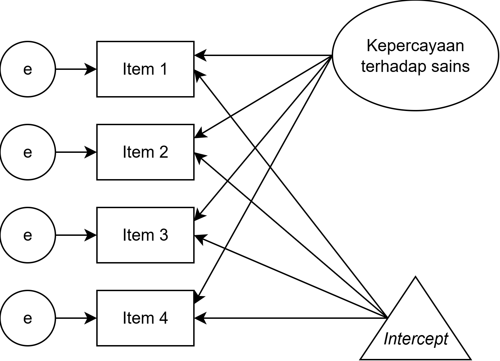
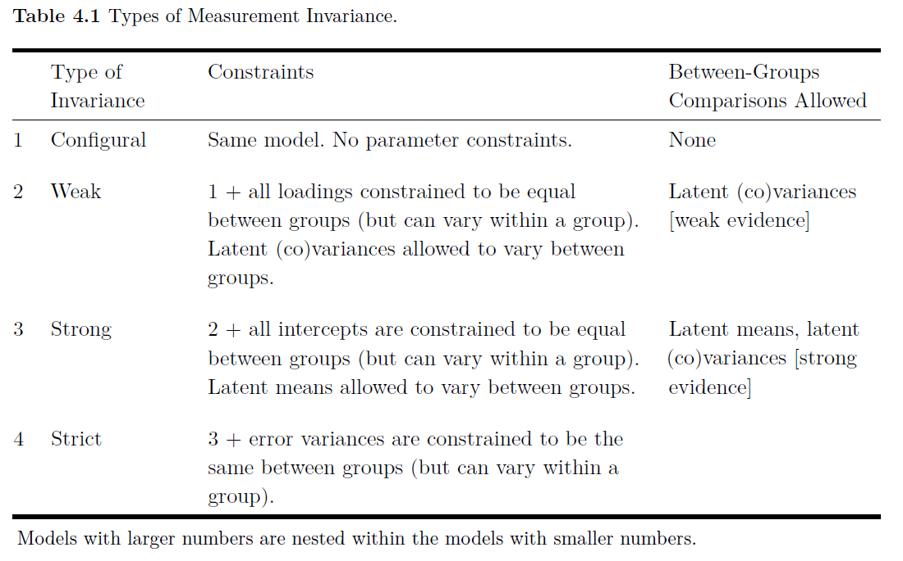

## _Outline_

* Kapan perlu menggunakan MG-SEM?
* *Measurement invariance*
  * *Configural invariance*
  * *Weak/metric invariance*
  * *Strong/scalar invariance*
  * *Strict/residual invariance*
  * *Homogeneity of latent variable variances*
  * *Homogeneity of factor means*
* Mengevaluasi *measurement invariance*
* Menuliskan hasil analisis MG-SEM dalam laporan penelitian

## *Multigroup* SEM: untuk apa?

::: {.incremental}

* *Invariance*  apakah dalam kondisi di subkelompok yang beragam ketika melakukan pengukuran, alat ukur selalu mengukur atribut ukur yang sama

* *Measurement invariance*  dua atau lebih kelompok memiliki properti psikometrik yang sama, yaitu variabel laten dalam model pengukuran adalah konstruk yang sama

* Ketika membandingkan model pengukuran di dua atau lebih kelompok yang berbeda, untuk menyimpulkan terjadinya *invariance*, maka peneliti akan menginginkan *chi-square* (χ²) yang *p-value*nya ≤ α

* Kalau kita berniat melakukan perbandingan performa alat ukur di dua kelompok sampel yang berbeda, maka kita lebih baik menggunakan ***means-covariance matrix*** bukan *variance-covariance matrix*  ingat *t-test* dan *anova*

:::

## *Means* dan *intercept*

::: {.columns}
::: {.column width="50%"}

* Kalau kita masukkan *mean* variabel laten ke dalam model, maka **_intercept_-nya juga harus dimasukkan dalam model**

* *Mean* dan *intercept* adalah ukuran *lokasi variabel*, dimana...
  - ***Mean*** adalah komponen ***common factor***
  - ***Intercept*** adalah komponen ***unique factor***

* *Intercept* disimbolkan dengan segitiga dan
  - **Hanya boleh "ketemu"** dengan panah *uni-directional* dan sifatnya *backwards*

:::
::: {.column width="50%"}

{fig-align="center" width="100%"}

:::
:::

## Jenis-jenis *measurement invariance* 1️⃣

* *Configural*
  - Jenis ini adalah yang paling dasar, yang mengasumsikan bahwa **model memiliki struktur yang sama** di **semua kelompok**
  - Karena hanya struktur faktor yang sama, sehingga belum ada yang bisa dibandingkan secara bermakna antar kelompok.
  - Oleh karena itu, semua kelompok **harus** memiliki **jumlah faktor/variabel laten** dan **jumlah variabel indikator/*observed* yang sama**
  - **Tidak ada ketentuan** bahwa parameter di dalam model harus setara di semua kelompok  tidak ada *between-group comparison*
  - Untuk mengeksekusi *configural invariance* tinggal menambahkan `grouping variable` di `jamovi` pada bagian **options**

## Jenis-jenis *measurement invariance* 2️⃣

* *Weak*/*metric*
  - **_Factor loading_ harus sama** pada setiap kelompok, tetapi **varians variabel laten boleh bervariasi**
  - Dinamai *weak* karena asumsinya masih lemah untuk menyimpulkan bahwa faktor laten **ekuivalen** di semua kelompok
  - Hubungan antar variabel laten (misalnya korelasi atau regresi) bisa dibandingkan
  - Untuk mengeksekusinya di `jamovi`, klik opsi `Multi-group analysis`, tambahkan data pengelompokan di `factor for multi-group analysis` dan centang pilihan `loadings` pada `equality constraints`

## Jenis-jenis *measurement invariance* 3️⃣

* *Strong*/*scalar*
  - **Selain *factor loading* harus sama**, *strong invariance* mensyaratkan **_intercept_ harus sama juga**
  - Ketika membatasi/*constraining* *intercept*, maka *latent means* boleh bervariasi (dan dibandingkan) di berbagai kelompok
  - Dengan asumsi *strong invariance* ekuivalensi variabel laten lebih didukung bukti yang kuat
  - Untuk mengeksekusinya di `jamovi`, klik opsi `Multi-group analysis`, tambahkan data pengelompokan di `factor for multi-group analysis` dan centang pilihan `loadings` dan `intercepts` pada `equality constraints`

## Jenis-jenis *measurement invariance* 4️⃣

* *Strict*/*residuals*
  - **Selain *factor loading* dan *intercept* harus sama**, *strict invariance* mensyaratkan **_varians error_/_residual_ sama juga**
  - Biasanya asumsi ini **tidak terlalu diperlukan** untuk membandingkan variabel laten di masing-masing kelompok
  - Untuk mengeksekusinya di `jamovi`, klik opsi `Multi-group analysis`, tambahkan data pengelompokan di `factor for multi-group analysis` dan centang pilihan `loadings`, `intercepts` dan `residuals` pada `equality constraints`

## Jenis-jenis *measurement invariance*

::: {.incremental}

* Homogenitas varians variabel laten
  - Untuk melihat apakah **varians variabel laten setara** di masing-masing kelompok
  - Kalau tidak terpenuhi berarti kelompok dengan varians variabel laten yang **lebih kecil** menggunakan **rentang konstruk yang lebih sempit**
  - Untuk mengeksekusinya klik opsi `Multi-group analysis`, tambahkan data pengelompokan di `factor for multi-group analysis` dan centang pilihan `latent variances` pada `equality constraints`

* Homogenitas *factor means*
  - Untuk melihat **apakah ada perbedaan *mean* variabel laten** di masing-masing kelompok
  - Prosedur yang sama dengan `anova` atau `t-test`
  - Untuk mengeksekusinya klik opsi `Multi-group analysis`, tambahkan data pengelompokan di `factor for multi-group analysis` dan centang pilihan `means` pada `equality constraints`

:::

## Evaluasi *measurement invariance*

#### Umumnya ada dua cara yaitu

::: {.incremental}

* **Pendekatan statistik**
  - Karena struktur data yang hirarkis, maka untuk mengevaluasi *invariance* perlu beberapa langkah
  - Dalam pendekatan statistik, peneliti dapat mengevaluasi **perubahan χ²** (Δχ²) ketika membandingkan model antar kelompok
  - Seharusnya ketika *constraint* model ditambah, maka Δχ² tidak signifikan, sehingga diperoleh *p-value* dari Δχ² > α (misalnya 0.05)

* **Pendekatan *modeling***
  - Pendekatan *modeling* menggunakan *approximate fit indices* (AFI) untuk menyimpulkan *invariance*
  - Yang bisa digunakan adalah *comparative fit index* (CFI) dan *McDonald's noncentrality fit index* (MFI), sehingga ketika **perubahan (Δ) CFI dan MFI antar model sangat kecil** (ΔCFI ≤ 0.01; [Cheung & Rensvold, 2002](https://doi.org/10.1177/1094428102005002005)), kita dapat simpulkan model *invariance* ✅

:::

## Perbandingannya

{fig-align="center" width="80%"}

::: {.aside}
Baujean, A.A. (2014). Latent Variable Modeling Using R: A step-by-step guide. New York: Routledge.
:::

## Demonstrasi *multigroup SEM*

* Mari kita lihat contoh penggunaan MGSEM

* [Unduh datasetnya disini](https://rameliaz.github.io/mg-sem-workshop/materials/dataset-asi.omv)

## Latihan mandiri 6️⃣ (terakhir 🙏): Mencoba *multigroup* SEM

::: {.columns}
::: {.column width="50%"}

* Unduh [Dataset Latihan SEM](https://rameliaz.github.io/mg-sem-workshop/materials/dataset-pilpres2024.csv)

* Unduh [Kamus Data disini](https://rameliaz.github.io/mg-sem-workshop/materials/codebook-pilpres2024.xlsx)

* Silahkan buat hipotesisnya, lalu spesifikasi model SEM dari variabel yang tersedia di dataset. Satu model sedikitnya mengandung 2 variabel laten.

* Lakukan MGSEM dengan membandingkan model laki-laki dan perempuan

:::
::: {.column width="50%"}

:::
:::

## Ada pertanyaan❓

{fig-align="center"}

::: {.callout-note}
* Paparan disusun dengan menggunakan  dan [**Quarto**](https://quarto.org) dengan *template* dari [UNAIR Theme](https://github.com/rameliaz/quarto-unair-theme).
* Kontak saya via <i class="fas fa-paper-plane"></i> <a href="mailto:amelia.zein@psikologi.unair.ac.id">amelia.zein@psikologi.unair.ac.id</a>
:::
