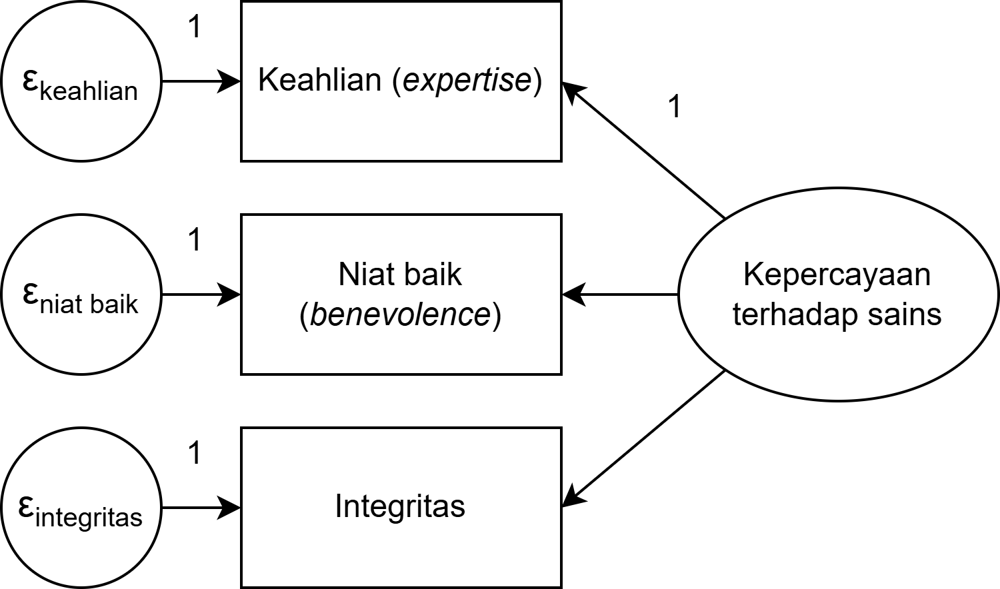
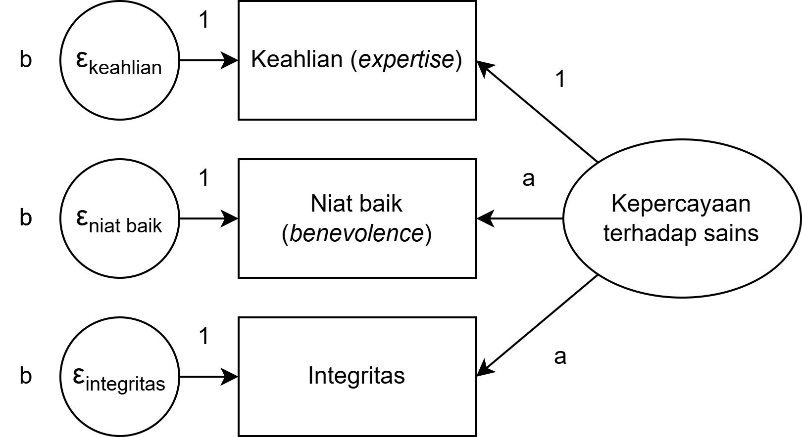
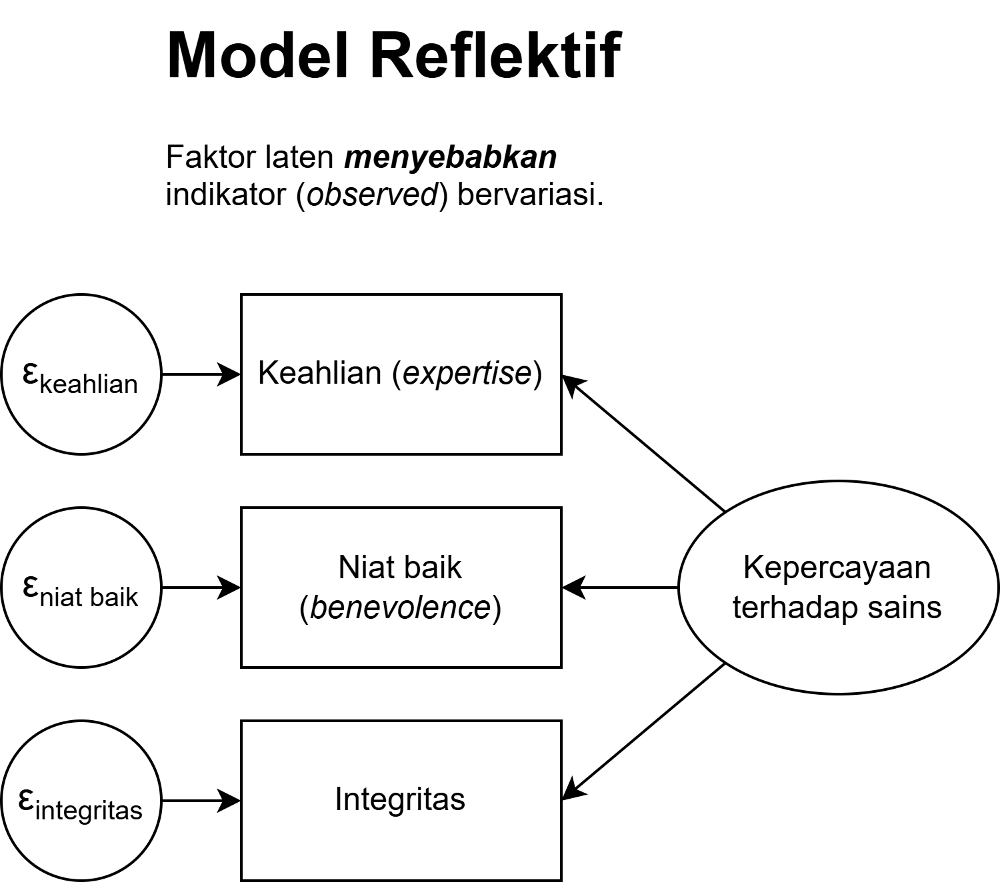

class: inverse, middle, title-slide, spaced

```{r setup, include=FALSE}
library(fontawesome)
library(tidyverse)
library(emo)
options(htmltools.dir.version = FALSE, width=120)
```

class: title-slide, spaced

   

# Multigroup Structural Equation Modeling (SEM)
## Menggunakan `JASP`: Bagian 4 - *Confirmatory Factor Analysis*
<br>
### <b>Rizqy Amelia Zein</b>
* Dosen, [Fakultas Psikologi, Universitas Airlangga](https://psikologi.unair.ac.id)
* Anggota, [#SainsTerbuka Airlangga](https://sainsterbukaua.github.io/) `r fa("universal-access")`
* Relawan, [INA-Rxiv](https://inarxiv.id) 
* Researcher-in-training, [Institute for Globally Distributed Open Research and Education (IGDORE)](https://igdore.org/)

---

class: inverse

# Analisis faktor

.pull-left[

* Awalnya dikembangkan oleh Charles Spearman (1904) untuk menyelidiki [*g factor theory of intelligence*](https://en.wikipedia.org/wiki/G_factor_(psychometrics))

* Terdiri dari:
  - *Exploratory factor analysis* (EFA) 
  - *Confirmatory factor analysis* (CFA)

* Analisis faktor digunakan untuk menguji model *common variance* 

* Mengasumsikan bahwa dua atau lebih *observed variable* memiliki *shared/common variance* (*commonality* atau *common factor*) `r fa("arrow-circle-right")` ditunjukkan dengan ***factor loading***

]

.pull-right[


]

---

# EFA vs CFA

| EFA | CFA |
| --- | --- |
| Mencari model yang cocok menggambarkan data, sehingga peneliti **mengeksplorasi berbagai pilihan model** yang cocok kemudian mencari rasionalisasi teoritisnya | Menguji hipotesis yang **sudah ditentukan sebelumnya**, sehingga peneliti ingin tahu apakah hipotesisnya didukung oleh data |
| Jumlah faktor belum diketahui sampai peneliti melakukan analisisnya | Jumlah faktor sudah ditentukan sebelum mengambil data |
| Peneliti **tidak memiliki** model yang dihipotesiskan *a priori* | Peneliti **sudah memiliki** model hipotesis yang ditentukan *a priori* |

---

# *Confirmatory factor analysis*

* Menyediakan solusi untuk mengkoreksi bias karena *measurement error* ketika mengestimasi korelasi antar-variabel

* Cara kerjanya adalah dengan membandingkan *variance-covariance matrix* yang dihipotesiskan dengan *variance-covariance matrix* pada data (sampel)

* **Perhatian**`r emo::ji("loud")`
  - **Sangat tidak disarankan** untuk melakukan EFA kemudian CFA pada **sampel yang sama**
  - Karena *generating hypothesis* dengan *testing hypothesis* adalah dua proses yang berbeda yang **tidak seharusnya** dilakukan pada sampel yang sama
  - Kalau hal tsb dilakukan, maka tentu saja peneliti akan mendapatkan hasil yang 'sesuai prediksinya'
  - Ingat [Texas Sharpshooter Fallacy](https://en.wikipedia.org/wiki/Texas_sharpshooter_fallacy#:~:targetText=The%20Texas%20sharpshooter%20fallacy%20is,a%20false%20conclusion%20is%20inferred.)

---

class: middle, center


---

# [*Constraining parameter* model](https://psycnet.apa.org/record/2008-06808-005)

* Membatasi/menentukan varians untuk setiap variabel/faktor laten
  - Dilakukan untuk mengeluarkan *standardised estimates*
  - ...yang interpretasinya sama seperti *standardised estimates* di regresi linear
  - *Factor loading* di *z-score*kan

* Membatasi/menentukan **satu** *error covariance* untuk setiap variabel/faktor laten
  - Dilakukan untuk menentukan *error covariance* yang lain

---

# Jenis-jenis model pengukuran

* *Congeneric*
  - Model yang paling moderat dan *default* di berbagai perangkat lunak SEM
  - Asumsinya, skala, *error variance*, dan *factor loading* **boleh berbeda (dibebaskan)**

* *Tau equivalence*
  - Model yang sedikit lebih rigid daripada *congeneric*
  - Asumsinya, skala dan *error variance* **boleh berbeda (dibebaskan)**, namun *factor loading* **harus sama (dibatasi)**
  - Ketika asumsi *tau equivalence* dipenuhi, maka [Cronbach's α dapat digunakan](https://www.ncbi.nlm.nih.gov/pubmed/28557467)

* Paralel
  - Model yang paling rigid
  - Asumsinya, skala, *error variance*, dan *factor loading* **harus sama (dibatasi)**
  
---

class: center, middle

<center></center><br>

---

class: center, middle

<center></center><br>

---

class: center, middle

<center></center><br>

---

# Reflektif vs Formatif

* Reflektif
  - Variabel laten **menjelaskan** mengapa **variabel indikator bervariasi**
  - Misalnya `r fa("arrow-circle-right")` individu dengan intelegensi yang tinggi akan mendapatkan nilai yang berbeda dalam tes matematika
  - Dalam hal ini, variasi **intelegensi**lah yang menjelaskan mengapa nilai tes matematika bervariasi
  - Biasanya mengasumsikan bahwa korelasi antar-variabel indikator = 0, karena seharusnya ketika (misalnya) nilai tes matematika dan fisika berkorelasi, korelasi tersebut dijelaskan oleh determinan yang sama (intelegensi)

* Formatif
  - Variabel *observed* menjelaskan mengapa variabel laten bervariasi
  - Misalnya `r fa("arrow-circle-right")` gengsi sebuah mobil ditentukan oleh usia mobil, kondisi, harga, dan intensitas pemakaian
  - Korelasi antara variabel *observed* tidak diketahui. Bisa jadi = 0, positif, atau negatif
  - Biasanya digunakan untuk menentukan indeks pada konstruk yang *orthogonal* (contoh `r fa("arrow-circle-right")` kepribadian pada *Five Factor model*)

---

class: center, middle

<center></center><br>

---

class: center, middle

<center></center><br>

---

# Apa yang terjadi ketika *error variance* berkorelasi?

<center></center><br>

* Kedua variabel indikator tersebut mengukur variabel laten lain di luar model (*unique factor*)
* Bisa jadi karena ada aitem *unfavourable* dalam skala 
* Perhatikan justifikasi teori ketika menambah *error covariance*

---

# Skor faktor (*factor scores*)

* Apabila kita memiliki informasi tentang *factor loading*, maka kita bisa menghitung *factor scores*

* Caranya dengan mengali *factor loading* dengan skor kasar `r fa("arrow-circle-right")` metode regresi

* Namun ingat, mengalikan *factor loading* dengan skor kasar berisiko mendapatkan estimasi yang bias, karena kedua parameter berasal dari distribusi data yang berbeda. Selain itu, *factor scores* akan berubah pada kelompok sampel yang berbeda.

* Ada tiga cara yang bisa digunakan untuk meghitung *factor scores*:
  - Metode regresi `r fa("arrow-circle-right")` dengan mengoptimalisasi validitas konstruk (*variance explained*)
  - Metode Bartlett `r fa("arrow-circle-right")` mengasumsikan variabel indikator **tidak saling berkorelasi**
  - Metode Anderson-Rubin `r fa("arrow-circle-right")` mengasumsikan variabel indikator **saling berkorelasi**

---

# Memilih metode estimasi

* *Maximum Likelihood* `r fa("arrow-circle-right")` distribusi data (*multivariate*) normal, level pengukuran harus interval, tidak ada data *missing*

* *Generalized least squares* `r fa("arrow-circle-right")` menggunakan asumsi yang sama dengan `ML` namun performanya kurang baik apabila dibandingkan dengan `ML`.

* *Weighted least squares* `r fa("arrow-circle-right")` dapat digunakan pada data kategorikal (nominal dan ordinal), estimasi menggunakan *polychoric correlation matrix*

* *Diagonally weighted least squares* `r fa("arrow-circle-right")` dapat digunakan pada data kategorikal, estimasi menggunakan *polychoric correlation matrix* yang kemudian dikonversi menjadi *asymptotic covariance matrix*, berkerja dengan baik pada sampel yang relatif kecil dan data yang tidak berdistribusi normal

---

class: inverse, middle, center

# Demonstrasi CFA


### [Unduh Dataset](https://rameliaz.github.io/mg-sem-workshop/contoh-cfa.jasp)

---

# TUGAS 4: Mencoba *confirmatory factor analysis*

* Unduh [Dataset Satu Kelompok](https://rameliaz.github.io/mg-sem-workshop/dataset-wave1.csv)

* Unduh [Kamus Data disini](https://rameliaz.github.io/mg-sem-workshop/codebook-kamusdata.csv)

* Lakukan CFA pada skala *right-wing authoritarianism* 
  - Diukur dengan skala *Likert*, 15 aitem dengan 9 pilihan jawaban

* Laporkan *model fit*, *factor loading*, dan *multivariate normality*

* Lakukan penyesuaian apabila perlu

### [Kumpulkan tugasnya disini](https://forms.gle/eNGD2LSzqaZc2nXM7)

---

class: center, middle

# Terima kasih banyak! `r emo::ji("wink")`


Paparan disusun dengan menggunakan `r fa("r-project")` *package* [**xaringan**](https://github.com/yihui/xaringan) dengan *template* dan *fonts* dari `R-Ladies`.

*Chakra* dibuat dengan [remark.js](https://remarkjs.com), [**knitr**](http://yihui.name/knitr), dan [R Markdown](https://rmarkdown.rstudio.com).