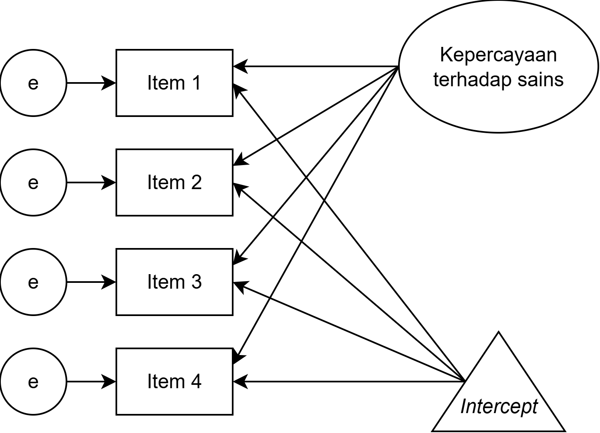
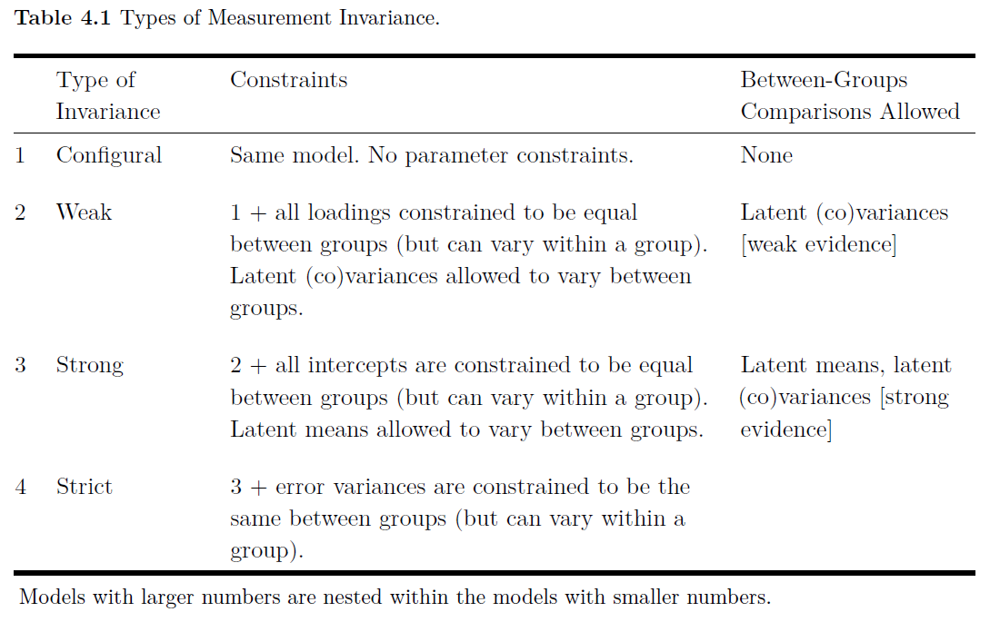

class: inverse, middle, title-slide, spaced

```{r setup, include=FALSE}
library(fontawesome)
library(tidyverse)
library(emo)
options(htmltools.dir.version = FALSE, width=120)
```

class: title-slide, spaced

   

# Multigroup Structural Equation Modeling (SEM)
## Menggunakan `JASP`: Bagian 6 - *Multigroup* SEM
<br>
### <b>Rizqy Amelia Zein</b>
* Dosen, [Fakultas Psikologi, Universitas Airlangga](https://psikologi.unair.ac.id)
* Anggota, [#SainsTerbuka Airlangga](https://sainsterbukaua.github.io/) `r fa("universal-access")`
* Relawan, [INA-Rxiv](https://inarxiv.id) 
* Researcher-in-training, [Institute for Globally Distributed Open Research and Education (IGDORE)](https://igdore.org/)

---

# *Multigroup* SEM: untuk apa?

* *Invariance* `r fa("arrow-circle-right")` apakah dalam kondisi yang beragam ketika melakukan pengukuran, alat ukur selalu mengukur atribut ukur yang sama

* *Measuremet invariance* `r fa("arrow-circle-right")` dua atau lebih kelompok memiliki model pengukuran yang sama, yaitu variabel laten dalam model pengukuran adalah konstruk yang sama

* Ketika membandingkan model pengukuran di dua atau lebih kelompok yang berbeda, untuk menyimpulkan terjadinya *invariance*, maka peneliti akan menginginkan *chi-square* (*X*<sup>2</sup>) yang *p-value*nya ≤ α*df* ratio

* Kalau kita berniat melakukan perbandingan performa alat ukur di dua kelompok sampel yang berbeda, maka kita lebih baik menggunakan ***means-covariance matrix*** bukan *variance-covariance matrix* `r fa("arrow-circle-right")` ingat *t-test* dan *anova*

---

# *Means* dan *intercept*

.pull-left[
* Kalau kita masukkan *mean* variabel laten ke dalam model, maka *intercept*nya juga harus dimasukkan dalam model

* *Mean* dan *intercept* adalah ukuran *lokasi variabel*, dimana
  - *Mean* adalah komponen *common factor*
  - *Intercept* adalah komponen *unique factor*

* *Intercept* disimbolkan dengan segitiga dan
  - Hanya boleh "ketemu" dengan panah *directional* dan sifatnya *backwards*
]

.pull-right[

<center></center><br>

]

---

# Jenis-jenis *measurement invariance*

* *Configural* 
  - Jenis ini adalah yang paling dasar, yang mengasumsikan bahwa model memiliki struktur yang sama di semua kelompok.
  - Oleh karena itu, semua kelompok **harus** memiliki jumlah faktor/variabel laten dan jumlah variabel indikator/*observed* yang sama dengan pola *constrained* dan *estimated parameters* yang sama
  - Tidak ada ketentuan bahwa paramter di dalam model harus setara di semua kelompok, sehingga dengan *configural invariance* saja memang sulit disimpulkan bahwa faktor/variabel laten adalah konstruk yang sama pada semua kelompok `r fa("arrow-circle-right")` tidak ada *between-group comparison*
  - Untuk mengeksekusi *configural variance* tinggal menambahkan `grouping variable` di `JASP` caranya pada bagian **options** masukkan variabel yang mengindikasikan kelompok
  
* *Weak*
  - *Factor loading* **harus sama** pada setiap kelompok, tetapi varians variabel laten **boleh bervariasi**
  - Dinamai *weak* karena asumsinya masih lemah untuk menyimpulkan bahwa faktor laten **ekuivalen** di semua kelompok, karena membolehkan varians variabel laten yang berbeda di masing-masing kelompok
  - Untuk mengeksekusi *weak variance* tambahkan `grouping variable` di `JASP` dan tik pilihan `loadings` pada `equality constraints`

---

# Jenis-jenis *measurement invariance*

* *Strong*
  - Selain *factor loading* harus sama, *strong invariance* mensyaratkan *intercept* **sama juga**
  - Ketika membatasi/*constraining* *intercept*, maka *means* boleh bervariasi di berbagai kelompok
  - Dengan asumsi *strong invariance* ekuivalensi variabel laten lebih didukung bukti yang kuat (daripada *configural* dan *weak invariance*)
  - Untuk mengeksekusi *strong variance* tambahkan `grouping variable` di `JASP` dan tik pilihan `loadings` dan `intercept` pada `equality constraints`

* *Strict*
  - Selain *factor loading* dan *intercept* harus sama, *strict invariance* mensyaratkan *varians error*/*residual* **sama juga**
  - Biasanya asumsi ini tidak terlalu diperlukan untuk membandingkan variabel laten di masing-masing kelompok, karena residual/*measurement error* di setiap kelompok **sangat wajar apabila berbeda** secara acak (*random error variance*) atau bisa jadi spesifik pada setiap indikator/*observed variable* (*indicator-specific variance*)
  - Untuk mengeksekusi *strict variance* tambahkan `grouping variable` di `JASP` dan tik pilihan `loadings`, `intercept`, dan `residuals` pada `equality constraints`

---

# Jenis-jenis *measurement invariance*

* Homogenitas varians variabel laten
  - Untuk melihat apakah **varians variabel laten setara** di masing-masing kelompok
  - Kalau tidak terpenuhi berarti kelompok dengan varians variabel laten yang **lebih kecil** menggunakan **rentang konstruk yang lebih sempit** daripada yang varians variabel latennya besar
  - Untuk mengeksekusinya `grouping variable` di `JASP` dan tik pilihan `latent variances`
  
* Homogenitas *factor means*
  - Untuk melihat apakah ada perbedaan *mean* variabel laten di masing-masing kelompok
  - Perosedur yang sama dengan `anova` atau `t-test`
  - Untuk mengeksekusinya `grouping variable` di `JASP` dan tik pilihan `means`
  
---

# Evaluasi *measurement invariance*

#### Umumnya ada dua cara yaitu

* Pendekatan statistik
  - Karena struktur data yang hirarkis, maka untuk mengevaluasi *invariance* perlu beberapa langkah 
  - Dalam pendekatan statistik, peneliti dapat mengevaluasi **perubahan *X*<sup>2</sup>** (Δ*X*<sup>2</sup>) ketika membandingkan model antar kelompok
  - Seharusnya ketika pembatasan model ditambah, maka Δ*X*<sup>2</sup>, sehingga seharusnya *p-value* dari Δ*X*<sup>2</sup> > α (misalnya 0.05)

* Pendekatan *modeling*
  - Pendekatan *modeling* menggunakan *approximate fit indices* (AFI) untuk menyimpulkan *invariance*
  - Yang bisa digunakan adalah *comparative fit index* (CFI) dan *McDonald's noncentrality fit index* (MFI), sehingga ketika **keduanya mendekati 1**, kita dapat simpulkan *invariance* `r emo::ji("ok")`

---

<center></center><br>

.footnote[

<sup>*</sup> Baujean, A.A. (2014). Latent Variable Modeling Using R: A step-by-step guide. New York: Routledge.

]

---

class: inverse

# Demonstrasi *multigroup SEM*

.pull-left[

### [Klik untuk unduh datasetnya disini](https://rameliaz.github.io/mg-sem-workshop/dataset-mg.csv)

### Atau pada repositori, unduh [**Dataset Contoh Multigroup SEM**](https://rameliaz.github.io/mg-sem-workshop/dataset-mg.csv)

]

.pull-right[


]

---

# TUGAS (Terakhir) 6: Mencoba *multigroup* SEM

.pull-left[

* Unduh [Dataset Latihan SEM](https://rameliaz.github.io/mg-sem-workshop/dataset-wave1.csv)

* Unduh [Kamus Data disini](https://rameliaz.github.io/mg-sem-workshop/codebook-kamusdata.xlsx)

* Cek *measurement invariance* pada skala *right-wing authoritarianism* antara laki-laki dan perempuan
  
* *Export* datasetnya menjadi `.htm` kemudian 

### [**Unggah tugasnya di sini**](https://forms.gle/6tdDH7Fin4xp7aL96)

]

.pull-right[


]

---

class: center, middle

# Terima kasih banyak! `r emo::ji("wink")`


Paparan disusun dengan menggunakan `r fa("r-project")` *package* [**xaringan**](https://github.com/yihui/xaringan) dengan *template* dan *fonts* dari `R-Ladies`.

*Chakra* dibuat dengan [remark.js](https://remarkjs.com), [**knitr**](http://yihui.name/knitr), dan [R Markdown](https://rmarkdown.rstudio.com).